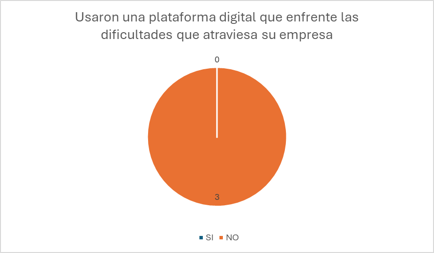
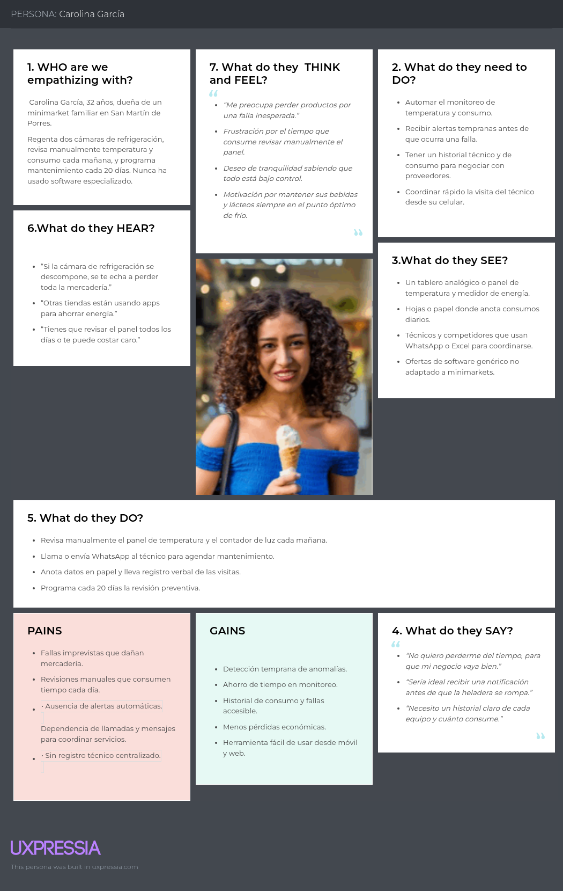
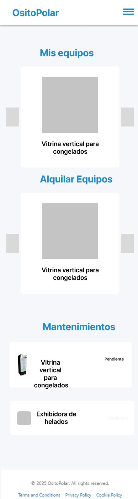
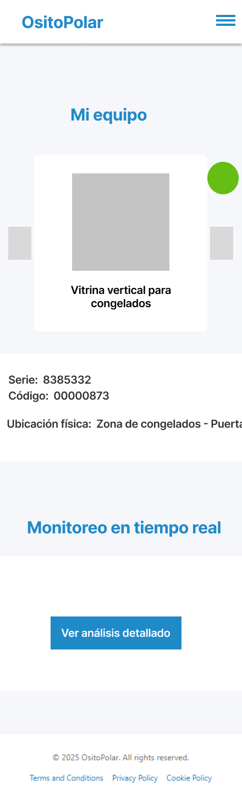

  <h1>Universidad Peruana de Ciencias Aplicadas</h1>
  
  <h2>Carrera: Ingeniería de Software</h2>
  <h2>Ciclo: 2025-20</h2>
  <h2>Curso: 1ACC0238 Aplicaciones para Dispositivos Móviles</h2>
  <h2>Sección: 12614</h2>
  <h2>Profesor: David Gerardo Quevedo Velasco</h2>
  <h1>Informe TB1</h1>
  <h2>Startup: IA: Inteligencia Artesanal</h2>
  <h2>Producto: OsitoPolar</h2>
  <h2>Integrantes</h2>
  <ul style="list-style: none;">
    <li>U202310425 Aguirre Castillo Sergio Cesar</li>
    <li>U202223811 Montañez Moreno, Luis Angel</li>
    <li>U202317442 Muñoz Machuca, Maria Elena</li>
    <li>U202223286 Rodriguez Parco Joseph Pablo</li>
    <li>U202123655 Rojas Reategui Victor Manuel</li>
  </ul>
  <h3>Septiembre 2025</h3>

## Registro de Versiones del Informe

| Versión | Fecha      | Autor               | Descripción de modificación                                     |
|---------|------------|----------------------|-----------------------------------------------------------------|
| 0.1     | 08/09/2025 | Joseph Rodriguez     | Desarrollo del Capítulo 1 y Capítulo 2                         |
| 0.2     | 17/09/2025 | Joseph Rodriguez     | Desarrollo del Capítulo 2 (entrevistas, competidores, segmentación) |

## Project Report Collaboration Insights
**TB1** Desarrollo del reporte hasta el capítulo 2 para el sprint 1
 

 

- **URL de la organización del proyecto:**  
  [https://github.com/Inteligencia-Artesanal-Aplicaciones-Web](https://github.com/Equipo5-Aplicaciones-Moviles/upc-Aplicaciones-Moviles-Equipo5.git)

- **URL del repositorio del informe del proyecto:**  
  [https://github.com/Inteligencia-Artesanal-Aplicaciones-Web/upc-AppWeb-Inteligencia-Artesanal-Report_v2](https://github.com/Equipo5-Aplicaciones-Moviles/upc-Aplicaciones-Moviles-Equipo5.git)]

# Objetivos SMART
# Chapter I: Presentation
- 1.1. Startup Profile
  - 1.1.1. Startup Description
  - 1.1.2. Team Member Profiles
- 1.2. Solution Profile
  - 1.2.1. Background and Problem Statement
  - 1.2.2. Lean UX Process
    - 1.2.2.1. Lean UX Problem Statements
    - 1.2.2.2. Lean UX Assumptions
    - 1.2.2.3. Lean UX Hypothesis Statements
    - 1.2.2.4. Lean UX Canvas
- 1.3. Target Segments

# Chapter II: Requirements Development and Software Solution Design
- 2.1. Competitors
  - 2.1.1. Competitive Analysis
  - 2.1.2. Strategies and Tactics Against Competitors
- 2.2. Interviews
  - 2.2.1. Interview Design
  - 2.2.2. Interview Records
  - 2.2.3. Interview Analysis
- 2.3. Needfinding
  - 2.3.1. User Personas
  - 2.3.2. User Task Matrix
  - 2.3.3. User Journey Mapping
  - 2.3.4. Empathy Mapping
  - 2.3.5. Ubiquitous Language
- 2.4. Requirements Specification
  - 2.4.1. User Stories
  - 2.4.2. Impact Mapping
  - 2.4.3. Product Backlog
- 2.5. Strategic-Level Domain-Driven Design
  - 2.5.1. EventStorming
    - 2.5.1.1. Candidate Context Discovery
    - 2.5.1.2. Domain Message Flows Modeling
    - 2.5.1.3. Bounded Context Canvases
  - 2.5.2. Context Mapping
  - 2.5.3. Software Architecture
    - 2.5.3.1. Software Architecture Context Level Diagrams
    - 2.5.3.2. Software Architecture Container Level Diagrams
    - 2.5.3.3. Software Architecture Deployment Diagrams
- 2.6. Tactical-Level Domain-Driven Design
  - 2.6.x. Bounded Context: <Bounded Context Name>
    - 2.6.x.1. Domain Layer
    - 2.6.x.2. Interface Layer
    - 2.6.x.3. Application Layer
    - 2.6.x.4. Infrastructure Layer
    - 2.6.x.5. Bounded Context Software Architecture Component Level Diagrams
    - 2.6.x.6. Bounded Context Software Architecture Code Level Diagrams
      - 2.6.x.6.1. Bounded Context Domain Layer Class Diagrams
      - 2.6.x.6.2. Bounded Context Database Design Diagram

# Chapter III: Solution UI/UX Design
- 3.1. Product Design
  - 3.1.1. Style Guidelines
    - 3.1.1.1. General Style Guidelines
  - 3.1.2. Information Architecture
    - 3.1.2.1. Organization Systems
    - 3.1.2.2. Labelling Systems
    - 3.1.2.3. SEO Tags and Meta Tags
    - 3.1.2.4. Searching Systems
    - 3.1.2.5. Navigation Systems
  - 3.1.3. Landing Page UI Design
    - 3.1.3.1. Landing Page Wireframe
    - 3.1.3.2. Landing Page Mock-up
  - 3.1.4. Mobile Applications UX/UI Design
    - 3.1.4.1. Mobile Applications Wireframes
    - 3.1.4.2. Mobile Applications Wireflow Diagrams
    - 3.1.4.3. Mobile Applications Mock-ups
    - 3.1.4.4. Mobile Applications User Flow Diagrams
    - 3.1.4.5. Mobile Applications Prototyping

# Chapter IV: Product Implementation & Validation
- 4. Product Implementation & Validation
- 4.1. Software Configuration Management
  - 4.1.1. Software Development Environment Configuration
  - 4.1.2. Source Code Management
  - 4.1.3. Source Code Style Guide & Conventions
  - 4.1.4. Software Deployment Configuration
- 4.2. Landing Page & Mobile Application Implementation
  - 4.2.1. Sprint n
    - 4.2.1.1. Sprint Planning n
    - 4.2.1.2. Sprint Backlog n
    - 4.2.1.3. Development Evidence for Sprint Review
    - 4.2.1.4. Testing Suite Evidence for Sprint Review
    - 4.2.1.5. Execution Evidence for Sprint Review
    - 4.2.1.6. Services Documentation Evidence for Sprint Review
    - 4.2.1.7. Software Deployment Evidence for Sprint Review
    - 4.2.1.8. Team Collaboration Insights during Sprint
- 4.3. Validation Interviews
  - 4.3.1. Interview Design
  - 4.3.2. Interview Records
  - 4.3.3. Heuristic Evaluations

# Conclusions
- Conclusions and Recommendations.

# Videos
- Video App Validation
- Video About the Product
- Video About the Team

# Glosario

# Bibliografia

# Anexos

## Student Outcome
El curso contribuye al cumplimiento del Student Outcome ABET:

**ABET – EAC - Student Outcome 7**

**Criterio**: *La capacidad de adquirir y aplicar nuevos conocimientos según sea 
necesario, utilizando estrategias de aprendizaje apropiadas.*

En el siguiente cuadro se describe las acciones realizadas y enunciados de
conclusiones por parte del grupo, que permiten sustentar el haber alcanzado el logro
del ABET – EAC - Student Outcome 7.

| Criterio específico | Acciones realizadas | Conclusiones |
|---------------------|--------------------|--------------|
| Actualiza conceptos y conocimientos necesarios para su desarrollo profesional y en especial para su proyecto en soluciones de software.  | <ul><li><b>Sergio Aguirre</b>  <b>TB1</b>: En esta entrega, durante el desarrollo de este informe, he tomado el rol de lider del equipo asignando tareas a todo el equipo y apoyando en todo lo posible. Me encargué de varias secciones que tenían que ver con el segmento objetivo 2, User Stories</li><li><b>Maria Elena Muñoz Machuca</b>  <b>TB1</b>: Fui responsable de realizar el context mapping,  bounded context canvases, y software architecture del bounded context de pagos  y suscripciones. </li><li><b>Victor Manuel Rojas Reategui</b>  <b>TB1</b>: Participé en las reuniones acordadas por el equipo y brindó apoyo para definir la estructura del proyecto. </li><li><b>Luis Montañez</b>  <b>TB1</b>: Se elaboraron de manera coordinada los entregables asegurando retroalimentación continua entre los miembros.<b>Joseph Rodríguez</b>  <b>TB1</b>: Aporté ideas clave en la construcción del prototipo, colaboré en la redacción del informe y asistí a todas las reuniones para coordinar las tareas del equipo. </li><li>Luis Montañez </li></ul> | <ul><li><b>TB1</b>: Durante el trabajo en equipo se fortalecieron y actualizaron los conocimientos técnicos y metodológicos, aplicándolos en la elaboración de artefactos de arquitectura, modelado de bounded contexts y definición de estructuras de software. Esto permitió que cada integrante refuerce su desarrollo profesional mientras aportaba valor concreto al proyecto.|
| Reconoce la necesidad del aprendizaje permanente para el desempeño profesional y el desarrollo de proyectos en soluciones de software. | <ul><li><b>Sergio Aguirre</b>  <b>TB1</b>: En esta entrega he colaborado junto con mi equipo en múltiples puntos a través de diferentes plataformas como Trello (para asignación de tareas), Miro (As-is y To-Be Scenarios), Figma (Algunos mockups).</li><li><b>Maria Elena Muñoz Machuca</b>  <b>TB1</b>:Fui responsable de realizar el context mapping,  bounded context canvases, y software architecture del bounded context de pagos  y suscripciones. </li><li><b>Victor Manuel Rojas Reategui</b>  <b>TB1</b>: Me encargé de la elaboración de los wireframes para la Landing Page, además de organizar las ramas y la estructura del repositorio Github. </li><li><b>Luis Montañez</b>  <b>TB1</b>: Se organizó mediante planificación conjunta, estableciendo plazos claros y distribuyendo tareas.<li><b>Joseph Rodriguez</b>  <b>TB1</b>: Me aseguré de cumplir puntualmente mis tareas asignadas, trabajé con mis compañeros en definir objetivos claros y realistas, y mantuve una comunicación constante a través de las plataformas acordadas.| <ul><li><b>TB1</b>: El equipo demostró la importancia del aprendizaje continuo al utilizar nuevas herramientas de gestión, diseño y colaboración, adaptándose a metodologías ágiles y aplicando buenas prácticas de documentación. Este enfoque permitió mejorar competencias individuales y colectivas, asegurando un mejor desempeño en el desarrollo del proyecto.|

# Objetivos Smart
#### Muñoz Machuca, Maria Elena
**Objetivo 1** 
Al culminar mi carrera, uno de mis principales objetivos es convertirme en desarrolladora de software full-stack, con dominio tanto de tecnologías de frontend como de backend. Para alcanzarlo, me propongo participar en proyectos completos que integren ambos enfoques. Mi meta es dedicar entre 8 y 10 horas semanales al estudio y práctica. 

**Objetivo 2** 
Otro de mis objetivos es desarrollar y diseñar soluciones tecnológicas que generen un impacto positivo en la vida de las personas. Para ello, me propongo crear al menos un proyecto propio que responda a un problema o necesidad social. Este propósito implica aprender y aplicar metodologías ágiles, de esta manera podré logar mi objetivos y mantener mi compromiso de mejorar la calidad de vida de las personas usando la tecnología.

#### Aguirre Castillo Sergio Cesar

**Objetivo 1**
Al culminar mi carrera, mi objetivo es convertirme en arquitecto de software especializado en diseño de sistemas distribuidos. Para ello, me propongo participar en proyectos académicos y profesionales donde pueda aplicar patrones de diseño y principios de arquitectura. Dedicaré un mínimo de 6 horas semanales al estudio de arquitectura de software y al uso de herramientas de modelado como UML y Structurizr.

**Objetivo 2**
Otro de mis objetivos es fortalecer mis habilidades de liderazgo en equipos de desarrollo. Para lograrlo, me propongo asumir roles de coordinación en al menos dos proyectos grupales y capacitarme en metodologías ágiles como Scrum y Kanban. Mediré mi progreso en función de la retroalimentación del equipo y la capacidad de cumplir con las metas establecidas en los proyectos.

#### Montañez Moreno, Luis Angel

**Objetivo 1**
Al finalizar mi carrera, mi objetivo es especializarme en desarrollo frontend, con dominio en frameworks modernos como React y Angular. Para alcanzarlo, dedicaré entre 5 y 7 horas semanales a cursos y prácticas de diseño de interfaces y usabilidad, aplicándolos en proyectos personales y académicos.

**Objetivo 2**
También me propongo contribuir al desarrollo de proyectos con impacto social mediante soluciones accesibles y responsivas. Para ello, me comprometo a diseñar al menos una aplicación web inclusiva antes de culminar mi carrera, siguiendo lineamientos de accesibilidad (WCAG) y buenas prácticas de UX/UI.

#### Rodriguez Parco Joseph Pablo

**Objetivo 1**
Mi objetivo principal al terminar la carrera es especializarme en desarrollo backend, enfocándome en tecnologías como .NET y Java. Para lograrlo, dedicaré al menos 6 horas semanales a proyectos y prácticas que refuercen mis conocimientos en bases de datos, APIs y servicios en la nube.

**Objetivo 2**
También quiero potenciar mis habilidades de trabajo en equipo y comunicación profesional. Para alcanzarlo, me propongo participar activamente en al menos tres proyectos colaborativos, asumiendo responsabilidades de integración de componentes y documentación. Mi progreso se medirá con la calidad de la comunicación y el cumplimiento de los objetivos en los plazos establecidos.

#### Rojas Reategui Victor Manuel

**Objetivo 1**
Mi objetivo al culminar la carrera es convertirme en ingeniero de software especializado en DevOps y despliegue de aplicaciones. Para lograrlo, me comprometo a dominar herramientas como Docker, Kubernetes y CI/CD pipelines, dedicando entre 5 y 8 horas semanales a la práctica en entornos reales o simulados.

**Objetivo 2**
Otro de mis objetivos es contribuir al despliegue eficiente y seguro de aplicaciones en la nube. Para ello, desarrollaré al menos un proyecto implementado en AWS o Azure antes de terminar la carrera, midiendo el éxito mediante pruebas de rendimiento, escalabilidad y seguridad.

# Capitulo 1: Introducción

## 1.1 Startup Profile

### 1.1.1 Descripción de la Startup

OsitoPolar es una aplicación móvil orientada a mejorar la gestión y el mantenimiento de equipos de congelación en negocios que dependen críticamente del frío, como supermercados, minimarkets, laboratorios, restaurantes y empresas del sector alimentario o farmacéutico. La solución conecta a estos negocios con técnicos y proveedores especializados en refrigeración, permitiendo una gestión integral, preventiva y automatizada de sus sistemas de congelación.

La plataforma ofrece funcionalidades clave como monitoreo en tiempo real de temperatura, consumo energético y tiempo de uso, generación de reportes técnicos, alertas automatizadas por fallas, historial de rendimiento, y programación inteligente de mantenimientos. Estas herramientas permiten a los usuarios optimizar sus operaciones, evitar pérdidas económicas por fallas inesperadas y mantener un registro completo del estado y uso de sus equipos.

OsitoPolar no solo está diseñado para negocios que utilizan equipos de frío, sino también para empresas proveedoras de equipos y serviciós de refrigeración. A través de su módulo especializado, los técnicos pueden visualizar todos los equipos que atienden, gestionar sus visitas, acceder al historial técnico de cada unidad y generar reportes de forma automática.

Misión: Nuestra misión en OsitoPolar es proporcionar una solución tecnológica inteligente que permita a los negocios proteger su inventario y optimizar la gestión de sus equipos de refrigeración, ofreciendo al mismo tiempo herramientas especializadas para mejorar la eficiencia operativa de los técnicos y proveedores del sector.

Visión: Queremos ser la empresa lider en gestión y mantenimiento de equipos de refrigeración, empezando por Lima y prontamente expandirnos a más lugares del Perú.

### 1.1.2 Perfiles de integrantes del equipo

| **Integrante** | **Joseph Pablo Rodriguez Parco** |
|----------------|----------------------------------|
| **Código del Estudiante** | U202223286 |
| **Carrera** | Ingeniería de Software |
| **Descripción** | Estudiante de Ingeniería de Software con afinidad por proyectos Web, Interesado en ML, Data Science y aprender por sobre todas las cosas. |
| **Foto** |  |

---

| **Integrante** | **Aguirre Castillo, Sergio Cesar** |
|----------------|----------------------------------|
| **Código del Estudiante** | U202310425 |
| **Carrera** | Ingeniería de Software |
| **Descripción** | Soy Aguirre Castillo, Sergio Cesar, tengo 20 años y actualmente curso el sexto ciclo de la carrera de Ingeniería de Software. Me caracterizo por mi sentido de responsabilidad y mi habilidad para trabajar en equipo. Disfruto colaborar con mis compañeros y aportar al cumplimiento de objetivos en el ámbito académico y en proyectos grupales. Poseo experiencia en diversos lenguajes de programación, como C++, Python y Java, además de conocimientos en bases de datos SQL y NoSQL. |
| **Foto** | |

---

| **Integrante** | **Victor Manuel Rojas Reategui** |
|----------------|----------------------------------|
| **Código del Estudiante** | U202123655 |
| **Carrera** | Ingeniería de Software |
| **Descripción** | Soy Victor Rojas y voy en el 5to ciclo de la carrera de Ingeniería de Software. Me gusta lo rápido que cambia la tecnología en la actualidad, por lo que este curso me ayudará a expandir mis conocimientos y a explorar nuevas aplicaciones de mi carrera que no había experimentado antes. |
| **Foto** |  |

---

| **Integrante** | **Maria Elena Muñoz Machuca** |
|----------------|----------------------------------|
| **Código del Estudiante** | U202317442 |
| **Carrera** | Ingeniería de Software |
| **Descripción** | Soy estudiante de la Universidad Peruana de Ciencias Aplicadas (UPC) y soy de la carrera de Ingeniería de Software cursando el sexto ciclo de la carrera. Mi objetivo es aprender más sobre desarrollo de software asi como adquirir experiencia en otros lenguajes de programación. |
| **Foto** |  |

---

| **Integrante** | **Luis Angel Montañez Moreno** |
|----------------|----------------------------------|
| **Código del Estudiante** | U202223811 |
| **Carrera** | Ingeniería de Software |
| **Descripción** | Soy un estudiante de 5to ciclo de la carrera de Ingeniería de Software que le gusta aprender sobre la tecnología y cómo su uso puede mejorar nuestra vida cotidiana. Mi objetivo es seguir adquiriendo conocimientos en lenguajes de programación para ser más competente en el mundo profesional. |
| **Foto** |  |
## 1.2 Solution Profile

### 1.2.1 Antecedentes y Problematica

| Las 5Ws y 2Hs | Pregunta                                           | Descripción                                                                                                                                                                                                                                                                                                                                                                                    |
|---------------|----------------------------------------------------|------------------------------------------------------------------------------------------------------------------------------------------------------------------------------------------------------------------------------------------------------------------------------------------------------------------------------------------------------------------------------------------------|
| What?         | ¿Cuál es el problema?                              | Actualmente, los negocios que dependen de equipos de congelación enfrentan grandes desafíos operativos ante fallas inesperadas o falta de mantenimiento. Las fallas térmicas, los altos consumos energéticos no detectados a tiempo y la ausencia de un monitoreo constante pueden derivar en la pérdida de productos, reducción de la calidad del servicio y pérdidas económicas importantes. |
| When?         | ¿Cuándo sucede este problema?                      | Estas situaciones ocurren principalmente durante horarios de operación continua, especialmente en momentos donde no hay personal técnico disponible de forma inmediata, o cuando no se ha realizado un seguimiento adecuado del estado del equipo a lo largo del tiempo.                                                                                                                       |
| Where?        | ¿Dónde se produce este suceso?                     | El problema afecta a negocios ubicados en todo el país, principalmente en Lima, donde la cadena de frío es esencial en sectores como alimentación, medicina y distribución. También impacta a empresas proveedoras de refrigeración que atienden múltiples clientes sin una plataforma centralizada de control.                                                                                |
| Who?          | ¿Quiénes están involucrados?                       | Están involucrados tanto los administradores y dueños de negocios que utilizan congeladoras como los técnicos y empresas proveedoras de servicios de refrigeración.                                                                                                                                                                                                                            |
| Why?          | ¿Cuál es la causa del problema?                    | La causa principal es la falta de soluciones tecnológicas accesibles que integren monitoreo, alertas, historial y programación automática en un solo lugar. Muchas empresas aún dependen de sistemas manuales o no tienen control de lo que sucede con sus equipos hasta que ocurre una falla crítica.                                                                                         |
| How?          | ¿Qué llevó a la persona a llegar a esta situación? | Lo que llevó a los negocios y técnicos a este punto ha sido la acumulación de imprevistos y la falta de digitalización en el mantenimiento preventivo, que genera una alta dependencia de intervenciones reactivas en vez de planificadas. Esto incrementa los costos, los tiempos de respuesta y el desgaste operativo.                                                                       |
| How much?     | ¿Cuánto es el impacto financiero?                  | Aunque el impacto económico varía según el tipo de negocio, la pérdida por una falla en un equipo de refrigeración puede ascender desde cientos hasta miles de soles en productos dañados, sin considerar el tiempo operativo perdido, la pérdida de clientes y la inversión en reparación o reposición de equipos.                                                                            |

### 1.2.2 Lean UX Process

#### 1.2.2.1 Lean UX Problem Statements

El estado actual de la industria de la refrigeración comercial y técnica enfrenta importantes desafíos relacionados con la gestión, el mantenimiento y la trazabilidad de los equipos de congelación. Negocios que dependen críticamente del frío —como supermercados, minimarkets, laboratorios, restaurantes y empresas del sector alimentario o farmacéutico— aún lidian con la falta de monitoreo en tiempo real y con procesos de mantenimiento reactivos. Esto genera pérdidas económicas, ineficiencia energética y riesgos para el inventario.

Hemos identificado una brecha significativa: las soluciones actuales no abordan de manera integral la necesidad de una plataforma confiable y automatizada que permita la gestión centralizada, predictiva y transparente de los sistemas de refrigeración. La ausencia de un historial técnico accesible, reportes detallados y alertas preventivas limita la capacidad de respuesta ante fallas y reduce la eficiencia del servicio técnico.

**¿Cómo podríamos reducir las fallas imprevistas y optimizar el mantenimiento de los sistemas de refrigeración comercial mediante una plataforma digital que conecte negocios y técnicos especializados?**

OsitoPolar busca cerrar esta brecha ofreciendo una solución tecnológica integral que conecte negocios con técnicos certificados, brindando funcionalidades como monitoreo en tiempo real de temperatura y consumo, programación inteligente de mantenimientos, alertas tempranas y trazabilidad completa de cada equipo. Con un enfoque inicial en los negocios de Lima, la plataforma permitirá profesionalizar el servicio técnico y optimizar la operación de los sistemas de frío, incrementando la satisfacción de los usuarios y la continuidad del servicio.

Sabremos que hemos tenido éxito cuando logremos reducir la cantidad de fallas imprevistas, mejorar la eficiencia energética, aumentar la productividad de los técnicos y evidenciar una mayor fidelización de los usuarios de la plataforma.

#### 1.2.2.2 Lean UX Assumption

# Business Outcomes

- Aumentar en al menos un 15% la cantidad de usuarios activos dentro de la aplicación.
- Lograr una mayor visibilidad de la plataforma OsitoPolar a través de redes sociales, especialmente entre negocios de alimentos y técnicos de refrigeración.
- Generar confianza y seguridad en los usuarios respecto al monitoreo y mantenimiento automatizado de sus sistemas de refrigeración.
- Mantener informado al usuario final sobre incidentes recientes como fallas térmicas, cortes de energía o uso irregular de los equipos.
- Alcanzar una base sólida de usuarios dispuestos a pagar por una membresía premium que incluya mantenimiento predictivo, reportes personalizados y soporte técnico prioritario.
- Establecer alianzas estratégicas con plataformas como Google Maps o servicios de geolocalización para ampliar el alcance de cobertura y optimizar la programación de visitas técnicas.
- Fomentar la participación activa de los usuarios mediante encuestas, valoraciones de técnicos y comentarios sobre el desempeño de los equipos.
- Diseñar una interfaz limpia, simple e intuitiva que garantice una experiencia fluida y atractiva para nuevos usuarios, evitando la sobrecarga visual o de funcionalidades.
- Implementar inteligencia artificial que permita trazar estrategias de mantenimiento inteligente, rutas eficientes para los técnicos y recomendaciones proactivas ante posibles fallos.

# User Outcomes

## ¿Quién será nuestro usuario?

- **Negocios que dependen críticamente del uso de sistemas de refrigeración** como supermercados, minimarkets, restaurantes, laboratorios y empresas del rubro alimentario y farmacéutico.
- **Técnicos especializados en refrigeración** que brindan mantenimiento a dichos sistemas.
- **Proveedores de equipos de refrigeración** que desean ofrecer un servicio posventa más eficiente.

## ¿Dónde encaja nuestro producto en su vida?

- En situaciones donde los negocios necesitan garantizar la continuidad operativa de sus equipos de frío, evitando pérdidas económicas por fallas imprevistas.
- En el día a día de técnicos de refrigeración que deben gestionar múltiples clientes, visitas y mantenimientos.
- En la operación diaria de los negocios que necesitan registros y reportes precisos del desempeño de sus sistemas de refrigeración.

## ¿Qué problemas tiene nuestro producto y cómo se pueden resolver?

- El principal desafío es asegurar que los datos de monitoreo (temperatura, consumo energético, fallas, etc.) sean precisos, actualizados y confiables.  
  **Solución**: Se debe integrar sensores calibrados y sistemas de verificación automática que validen las lecturas antes de almacenarlas.
- Otro problema puede ser la adopción inicial de la plataforma por parte de usuarios no tecnológicos.  
  **Solución**: Esto se abordará con una interfaz sencilla, explicaciones paso a paso y soporte técnico accesible.

## ¿Cómo y Cuándo es usado nuestro producto?

- Se accede desde la aplicación web, tanto desde computadoras como dispositivos móviles.
- Se utiliza diariamente para monitorear el estado de los equipos de frío, recibir alertas, programar mantenimientos o revisar el historial técnico.
- También se activa automáticamente en segundo plano cuando se integran sensores de monitoreo con la plataforma.

## ¿Qué problemas tiene nuestro producto?

- En sus etapas iniciales, puede carecer de ciertas integraciones con hardware de terceros.
- Algunos usuarios pueden requerir capacitación para comprender todas las funcionalidades avanzadas.
- También podría haber desafíos para que los técnicos adopten el uso digital en lugar del método tradicional.

## ¿Qué características son importantes para la app?

- Monitoreo en tiempo real de temperatura, consumo energético y tiempo de uso.
- Alertas automáticas por fallas detectadas en los equipos.
- Historial técnico completo con reportes exportables en PDF.
- Calendario de mantenimiento preventivo con notificaciones programadas.
- Módulo exclusivo para técnicos con gestión de visitas y clientes.
- Soporte técnico inteligente y recomendaciones predictivas mediante IA.
- Registro de múltiples ubicaciones y usuarios con distintos roles.
- Interfaz intuitiva y minimalista para garantizar fácil adopción.

## ¿Cómo debe verse nuestro producto y cómo comportarse?

- **Interfaz amigable y confiable**: Los usuarios deben sentirse seguros al usar la aplicación. La interfaz debe ser clara, ordenada y fácil de navegar, sin sobrecargar de información, con gráficos e indicadores intuitivos.
- **Diseño centrado en tareas críticas**: Desde el primer acceso, los usuarios deben poder ver si hay fallas, cuándo es la próxima visita técnica, y acceder rápidamente a los reportes y al historial de sus equipos.
- **Accesibilidad multiplataforma**: Disponible en web y móvil, adaptable para usuarios que están en oficina o en campo. Notificaciones inmediatas ante cualquier problema detectado.
- **Simplicidad**: La app debe permitirles ver sus clientes, equipos en riesgo y visitas programadas, todo desde un panel centralizado. Pueden agendar visitas y generar reportes técnicos en segundos.

## ¿Qué valor busca el cliente?

- **Gestión técnica simplificada**: Los proveedores y técnicos buscan dejar de ser reactivos. OsitoPolar los vuelve proactivos con mantenimiento predictivo, historiales claros y clientes organizados.
- **Seguridad operativa y cero sorpresas**: Los negocios quieren evitar pérdidas por fallas en frío. OsitoPolar les da monitoreo constante, alertas automáticas y control total sobre sus equipos.
- **Eficiencia energética y trazabilidad**: Los dueños quieren saber si sus equipos consumen de más, si están rindiendo mal, o si un componente ya debería ser reemplazado. El sistema lo identifica antes que ocurra el fallo.

## ¿Qué beneficios adicionales obtendrá el cliente?

- Visibilidad total del estado de sus equipos, desde cualquier lugar, en cualquier momento.
- Soporte técnico más ágil gracias al historial previo y alertas automáticas.
- Menores costos operativos gracias a mantenimientos a tiempo y mayor eficiencia energética.
- Reportes personalizados y exportables.
- Automatización de visitas técnicas cuando se detectan patrones de falla.

## ¿Cómo atraeremos usuarios?

- **Marketing dirigido a nichos clave**: Supermercados, restaurantes y empresas de frío serán contactados directamente mediante LinkedIn, correos y llamadas estratégicas.
- **Alianzas con proveedores de equipos**: Trabajaremos con empresas que venden congeladoras o cámaras frigoríficas para que incluyan OsitoPolar en sus paquetes posventa.
- **Prueba gratuita de versiones de pago**: Un modelo de 14 días gratis con monitoreo limitado para mostrar el valor de la plataforma en tiempo real.

## ¿Cómo generaremos ingresos?

- **Suscripción mensual de negocios**: Por el uso de la plataforma, según número de equipos, tipo de reportes y funcionalidades.
- **Modelo freemium**: Habrá una versión gratuita que brindará algunas funciones limitadas, pero con anuncios, lo que generará ingresos adicionales.
- **Publicidad dirigida (opcional)**: Marcas de refrigeración podrían pagar por visibilidad dentro de la plataforma si se llega a una masa crítica de técnicos y negocios.

## ¿Cuál es nuestra competencia y cómo la superamos?

- **Competencia**: Las principales competidoras son aplicaciones relacionadas con la gestión de datos y orientada al servicio técnico de mantenimiento de equipos de refrigeración.
- **Nuestra ventaja**: OsitoPolar fue diseñado exclusivamente para negocios que dependen de equipos de frío. No somos una herramienta genérica, somos expertos en el nicho. No solo registramos visitas o mantenimientos, también detectamos anomalías en tiempo real, generamos alertas y automatizamos acciones.

## ¿Cuál es nuestro mayor riesgo?

- **Adopción lenta por parte del personal tradicional**: Algunos proveedores aún dependen de agendas físicas o Excel y podrían resistirse al cambio.
- **Falta de adopción inicial**: La dificultad para convencer a los primeros usuarios de que la app es útil y confiable puede retrasar su adopción.
- **Desconfianza en la precisión de los sensores**: Si los datos no son confiables, la plataforma pierde valor

## ¿Cómo lo resolveremos?

- **Algoritmos de validación**: Implementaremos algoritmos de IA que verifiquen la información y filtren los reportes ambiguos o antiguos, garantizando solo datos confiables y actuales.
- **Capacitación y soporte**: Para resolver la falta de adopción, ofreceremos tutoriales interactivos, videos explicativos y soporte técnico accesible para que los usuarios se familiaricen con las funciones.
- **Estrategia progresiva de integraciones**: Comenzaremos con los equipos más usados y luego ampliaremos compatibilidad mediante APIs y alianzas con fabricantes.
- **Sensores certificados**: Solo se integrarán sensores probados.

#### 1.2.2.2 Lean UX Hypothesis Statements

### Hipótesis 1: Eficiencia operativa y reducción de fallas inesperadas

Creemos que **al ofrecer una plataforma integral que unifique las funciones de monitoreo, mantenimiento y gestión técnica de equipos de refrigeración**, aumentaremos la eficiencia operativa de los negocios y proveedores del sector, reduciendo la complejidad y el riesgo de fallas inesperadas.  
Sabremos que hemos tenido éxito **cuando observemos una reducción del 30% en las incidencias por fallas térmicas reportadas** y **un aumento del 25% en la planificación de mantenimientos preventivos dentro de la plataforma** durante los primeros seis meses.

---

### Hipótesis 2: Control de pérdidas operativas y consumo energético

Creemos que **al proporcionar herramientas de análisis de rendimiento y alertas automatizadas**, los negocios podrán actuar de forma preventiva y reducir costos innecesarios asociados al consumo energético y pérdidas operativas.  
Sabremos que hemos tenido éxito **cuando observemos una disminución del 20% en los costos energéticos mensuales promedio** y **un incremento del 30% en el uso de los reportes de monitoreo en tiempo real** por parte de los usuarios activos.

---

### Hipótesis 3: Mejora en el servicio técnico personalizado y predictivo

Creemos que **al implementar reportes automáticos e históricos de rendimiento por equipo**, los técnicos y proveedores podrán ofrecer un servicio más personalizado y predictivo, aumentando la calidad del soporte brindado.  
Sabremos que hemos tenido éxito **cuando más del 70% de los técnicos califiquen positivamente los reportes automáticos en encuestas internas** y **cuando los clientes reporten un aumento del 25% en su satisfacción con la rapidez del servicio técnico.**

---

### Hipótesis 4: Trazabilidad y protección de la información técnica

Creemos que **al garantizar la trazabilidad completa y la protección de los datos técnicos en la plataforma**, construiremos confianza entre los negocios y los proveedores de servicios.  
Sabremos que hemos tenido éxito **cuando logremos reducir en un 40% los errores administrativos o pérdidas de información** y **aumentar en un 30% la retención de usuarios técnicos y empresariales activos.**

---

### Hipótesis 5: Transición hacia una gestión moderna de refrigeración

Creemos que **al ofrecer una solución digital intuitiva y especializada tanto para negocios como para técnicos**, facilitaremos la transición hacia una gestión moderna y eficiente de la refrigeración.  
Sabremos que hemos tenido éxito **cuando alcancemos una tasa de adopción del 60% de usuarios nuevos dentro de los tres primeros meses** y **una tasa de retención del 80% tras seis meses de uso continuo de la plataforma.**

#### 1.2.2.4 Lean UX Canvas

El presente Lean UX Canvas se ha desarrollado para ofrecer una visión estratégica y concisa de la solución OsitoPolar. Este marco nos permite alinear rápidamente los objetivos de negocio con las necesidades de nuestros usuarios y las hipótesis clave que guían nuestro desarrollo.
A través de este lienzo, hemos desglosado el problema central que enfrentan los negocios que dependen de equipos de refrigeración, definido las soluciones propuestas y anticipado los resultados que esperamos alcanzar.
Asimismo, hemos identificado a nuestros usuarios clave y sus beneficios, y hemos establecido una serie de hipótesis que nos permitirán validar nuestro enfoque con la mínima inversión de tiempo y recursos posible, asegurando que cada paso que demos esté centrado en generar valor real.

<figure style="page-break-inside: avoid; text-align: center;">
  
  <figcaption style="font-size: 0.9em; color: #555;">
    <strong>Figura 1:</strong> Lean UX Canvas.
  </figcaption>
</figure>

## 1.3 Segmentos objetivos

**Segmento Objetivo #1: Negocios que utilizan equipos de refrigeración**

**Aspectos demográficos:**
- **Tipo de negocio**: Pequeñas, medianas y grandes empresas
- **Rubro**: Alimentario, farmacéutico, restauración y comercio minorista
- **Nivel de necesidad**: Alta dependencia de sistemas de refrigeración

**Aspectos geográficos:**
- **Nacionalidad**: Peruana
- **Zona geográfica**: Urbana
- **Departamento**: Lima (con proyección de expansión nacional)

**Aspectos psicográficos:**
- Empresas que buscan evitar pérdidas económicas por fallas en refrigeración.
- Negocios que requieren control eficiente del consumo energético.
- Administradores interesados en implementar tecnología para optimizar sus operaciones y mantener la calidad del inventario.

---

**Segmento Objetivo #2: Empresas proveedoras de servicios y equipos de refrigeración**

**Aspectos demográficos:**
- **Tipo de empresa**: Técnicos independientes, PYMES y proveedores especializados en refrigeración.
- **Rol**: Técnicos de mantenimiento, instaladores, empresas de soporte técnico.

**Aspectos geográficos:**
- **Nacionalidad**: Peruana
- **Zona geográfica**: Urbana
- **Departamento**: Lima (con visión de expansión a nivel nacional)

**Aspectos psicográficos:**
- Técnicos que desean organizar sus visitas de forma eficiente y centralizada.
- Empresas que buscan mejorar la trazabilidad de sus servicios y ofrecer reportes automáticos.
- Profesionales que desean brindar un servicio más personalizado y predictivo a sus clientes.

## Capítulo II: Requirements Elicitation & Analysis 

### 2.1. Competidores

**Competidor 1: ServiceTitan**
ServiceTitan es una plataforma de gestión de servicios basada en la nube que ofrece soluciones de software para empresas de servicios, incluidos técnicos de HVAC, fontaneros y electricistas. Proporciona funcionalidades de programación, gestión de trabajos, facturación y más. Esta plataforma es conocida por su facilidad de uso y por ayudar a las empresas a optimizar sus operaciones de servicio técnico en tiempo real.

---

**Competidor 2: CoolMaster**
CoolMaster es una solución de software diseñada específicamente para el sector de refrigeración comercial. Ofrece monitoreo remoto de sistemas de refrigeración, alertas tempranas de fallas y gestión eficiente del consumo energético. La plataforma está orientada a optimizar la eficiencia operativa de negocios que dependen críticamente de sistemas de frío, como supermercados y centros de distribución.

---

**Competidor 3: TempGenius**
TempGenius es un software de monitoreo de temperatura y humedad en tiempo real para diversas industrias, incluida la de la refrigeración comercial. Permite a los usuarios realizar un seguimiento de sus equipos de refrigeración mediante sensores conectados a la nube, generar reportes y recibir alertas automáticas por variaciones en los niveles de temperatura. Su principal enfoque es mejorar la visibilidad y control de las operaciones de refrigeración para evitar pérdidas económicas.

#### 2.1.1. Análisis competitivo

<table> 
  <tr>
    <th colspan="7"> Competitive Analysis Landscape </th>
  </tr>
  <tr>
    <td colspan="2" rowspan="2">¿Por qué llevar acabo este análisis? </td>
    <td colspan="5"> Pregunta </td>
  </tr>
  <tr>
    <td colspan="5"> Respuesta </td>
  </tr>
  <tr>
    <td colspan="2"> Productos </td>
    <td> OsitoPolar </td>
    <td> ServiceTitan </td>
    <td> CoolMaster </td>
    <td> TempGenius </td>
  </tr>
  <tr>
    <td rowspan="2">Perfil</td>
    <td>Overview</td>
    <td> OsitoPolar es una plataforma integral de monitoreo y gestión para sistemas de refrigeración, que conecta negocios con técnicos especializados. Ofrece monitoreo en tiempo real, alertas automáticas, mantenimiento preventivo, y trazabilidad de cada equipo. </td>
    <td> ServiceTitan es una plataforma de gestión de servicios basada en la nube que ofrece soluciones de software para empresas de servicios, incluidos técnicos de HVAC, fontaneros y electricistas. </td>
    <td> CoolMaster es una solución de software diseñada específicamente para el sector de refrigeración comercial. Ofrece monitoreo remoto de sistemas de refrigeración, alertas preventivas y gestión energética. </td>
    <td> TempGenius es un software de monitoreo de temperatura y humedad en tiempo real para diversas industrias, incluida la refrigeración comercial. Permite a los usuarios gestionar y recibir alertas automáticas sobre sus equipos. </td>
  </tr>
  <tr>
    <td>Ventaja competitiva ¿Qué valor ofrece a los clientes?</td>
    <td> Ofrece una solución automatizada y centralizada para negocios que necesitan monitorear y gestionar sus equipos de refrigeración. Permite a los técnicos optimizar sus visitas y el mantenimiento preventivo, mejorando la eficiencia operativa. </td>
    <td> Ofrece una plataforma todo-en-uno para la gestión de servicios con características como la programación de citas, facturación y seguimiento en tiempo real de proyectos. </td>
    <td> Ofrece soluciones específicas para la gestión de sistemas de refrigeración, con funcionalidades avanzadas de monitoreo, alertas y análisis de consumo energético. </td>
    <td> Ofrece monitoreo preciso en tiempo real de la temperatura y humedad, con alertas automáticas, y un enfoque especial en la fiabilidad y precisión de los datos. </td>
  </tr>
  <tr>
    <td rowspan="2">Perfil de Marketing</td>
    <td> Mercado Objetivo </td>
    <td> Negocios que dependen de sistemas de refrigeración, como supermercados, minimarkets, laboratorios, restaurantes, entre otros. También incluye técnicos de refrigeración y proveedores de equipos. </td>
    <td> Empresas de servicios como HVAC, fontaneros, electricistas, y otros proveedores de servicios técnicos. </td>
    <td> Negocios que dependen de sistemas de refrigeración como supermercados, laboratorios, restaurantes y otros en el sector alimentario y farmacéutico. </td>
    <td> Usuarios de diversas industrias, especialmente en áreas que requieren monitoreo continuo de temperatura y humedad, como el sector alimentario y farmacéutico. </td>
  </tr>
  <tr>
    <td> Estrategias de Marketing </td>
    <td> Marketing digital, colaboraciones estratégicas con empresas del sector alimentario y farmacéutico, demostraciones gratuitas y promociones en redes sociales. </td>
    <td> Marketing digital, colaboraciones con empresas de servicios y promoción en plataformas de negocio. </td>
    <td> Marketing dirigido a negocios en el sector alimentario y farmacéutico, con énfasis en la reducción de fallas y el ahorro energético. </td>
    <td> Marketing en redes sociales, promociones para nuevos usuarios y colaboraciones con industrias reguladas como la farmacéutica y alimentaria. </td>
  </tr>
  <tr>
    <td rowspan="3">Perfil de Producto</td>
    <td> Productos & Servicios </td>
    <td> Gestión de equipos de refrigeración en tiempo real, alertas automáticas, mantenimiento preventivo, reportes técnicos automáticos y trazabilidad de cada equipo. </td>
    <td> Plataforma de gestión de servicios que incluye programación de citas, gestión de personal, facturación, y seguimiento de proyectos en tiempo real. </td>
    <td> Plataforma de monitoreo y gestión de sistemas de refrigeración, con alertas preventivas, informes automáticos y análisis de rendimiento energético. </td>
    <td> Plataforma de monitoreo de temperatura y humedad en tiempo real, con alertas automáticas, reportes detallados y gestión de datos históricos. </td>
  </tr>
  <tr>
    <td> Precios & Costos </td>
    <td> Modelo basado en comisiones bajas por cada reserva o cita pagada para negocios, con una versión gratuita para usuarios. </td>
    <td> Suscripción mensual o anual, con tarifas adicionales por características avanzadas o soporte personalizado. </td>
    <td> Varía según el plan y características seleccionadas, con opciones para negocios grandes o pequeños. </td>
    <td> Varía según la cantidad de equipos monitoreados y las características seleccionadas, con modelos de suscripción mensual o anual. </td>
  </tr>
  <tr> 
    <td>Canales de distribución (Web y/o Móvil)</td>
    <td> Plataforma en línea y aplicación móvil disponible para dispositivos iOS y Android. </td>
    <td> Plataforma en línea y aplicación móvil disponible para dispositivos iOS y Android. </td>
    <td> Plataforma en línea y aplicación móvil. </td>
    <td> Aplicación móvil disponible en tiendas de aplicaciones y plataforma en línea. </td>
  </tr>
  <tr>
    <td rowspan="4"> Análisis SWOT </td>
    <td> Fortalezas </td>
    <td> Monitoreo en tiempo real, alertas automáticas y mantenimiento preventivo para evitar fallas críticas. Función de trazabilidad completa de los equipos. </td>
    <td> Amplia funcionalidad para gestión de servicios y seguimiento en tiempo real de proyectos. </td>
    <td> Especialización en el monitoreo y la gestión de sistemas de refrigeración, con enfoque en ahorro energético. </td>
    <td> Precisión en el monitoreo de temperatura y humedad, con alertas automáticas y un enfoque flexible en diferentes industrias. </td>
  </tr>
  <tr>
    <td> Debilidades </td>
    <td> Dependencia de la adopción inicial por parte de los usuarios, lo que podría afectar la expansión. </td>
    <td> Puede ser más complejo de usar para pequeñas empresas sin experiencia en gestión de software. </td>
    <td> Enfoque limitado al sector de refrigeración, lo que puede dificultar la expansión a otros mercados. </td>
    <td> Puede resultar costoso para pequeñas empresas debido a las suscripciones y los costos adicionales por dispositivos. </td>
  </tr>
  <tr>
    <td> Oportunidades </td>
    <td> Expansión en el sector de la gestión de refrigeración, con foco en la eficiencia operativa y la reducción de costos. </td>
    <td> Expansión a nuevos mercados, introducción de nuevos servicios, mejorar la experiencia del usuario. </td>
    <td> Expansión a nuevos mercados, mejora continua de características y funciones, colaboraciones estratégicas con otros servicios. </td>
    <td> Expansión a nuevos mercados, introducción de nuevas características y servicios, colaboraciones estratégicas con marcas de belleza. </td>
  </tr>
  <tr>
    <td> Amenazas </td>
    <td> Competencia de aplicaciones ya establecidas en la gestión de refrigeración y mantenimiento. </td>
    <td> Competencia de otras plataformas de gestión de servicios que ofrecen características similares. </td>
    <td> Alta competencia en el mercado de soluciones para refrigeración y dependencia de la infraestructura de clientes. </td>
    <td> Competencia de otras plataformas de monitoreo de temperatura y humedad, con características similares y precios más bajos. </td>
  </tr>
</table>

#### 2.1.2. Estrategias y tácticas frente a competidores

Hemos identificado diversas estrategias y tácticas para diferenciarse y competir efectivamente con otros actores del mercado de la gestión y monitoreo de sistemas de refrigeración. A continuación se detallan las principales:

---

**1. Estrategias de Diferenciación:**

- **Automatización y Mantenimiento Preventivo**: A diferencia de los competidores, **OsitoPolar** se enfoca en ofrecer una solución integral con monitoreo en tiempo real, alertas automáticas y un sistema de mantenimiento preventivo. Esto permite a los negocios reducir las incidencias por fallas inesperadas y gestionar sus equipos de refrigeración de manera proactiva.

- **Trazabilidad Completa de Equipos**: Ofrecemos una plataforma que proporciona un historial técnico detallado de cada equipo, algo que competidores como **ServiceTitan** no ofrecen de forma especializada para el sector de refrigeración. Esto garantiza un mayor control sobre los activos y la calidad del servicio.

- **Interfaz Intuitiva y Fácil de Usar**: A diferencia de **CoolMaster**, que se centra más en el sector de refrigeración sin necesariamente pensar en la accesibilidad del usuario, **OsitoPolar** prioriza la simplicidad de uso, lo que facilita la adopción rápida por parte de los negocios y técnicos, independientemente de su experiencia tecnológica.

---

**2. Tácticas de Marketing:**

- **Marketing Digital y Demostraciones Gratuitas**: Enfocaremos nuestras campañas en redes sociales, demostraciones en vivo, y colaboraciones con negocios del sector alimentario y farmacéutico, destacando nuestra capacidad para reducir fallas y ahorrar costos en operaciones. Esta táctica se diferencia de **TempGenius**, que aún no ha adoptado un enfoque digital tan agresivo.

- **Fidelización de Usuarios a Largo Plazo**: Implementaremos programas de fidelización y un sistema de recompensas para los técnicos y negocios que continúen usando nuestra plataforma y colaboren con nosotros para mejorar el servicio. De esta forma, buscamos aumentar la lealtad, algo que muchos competidores no han logrado gestionar adecuadamente.

---

**3. Estrategias de Precios:**

- **Modelo Freemium**: Ofrecemos una versión básica gratuita para atraer a pequeños negocios y usuarios que no están seguros de pagar por un servicio premium de inmediato. Este modelo es más flexible que el de **ServiceTitan**, que depende de suscripciones pagadas desde el principio.

- **Comisiones Bajas por Reserva**: Para los negocios, aplicamos comisiones reducidas por cada cita reservada a través de nuestra plataforma, lo que facilita la adopción, especialmente en comparación con otros competidores como **CoolMaster**, que tiene costos fijos más elevados.

---

**4. Expansión y Adaptabilidad:**

- **Enfoque Regional Inicial y Expansión Nacional**: A diferencia de competidores como **TempGenius**, que tiene un enfoque global, **OsitoPolar** comenzará en Lima con planes de expansión a otras ciudades del Perú. Esto nos permite adaptarnos mejor a las necesidades locales antes de expandirnos a nivel internacional.

- **Colaboraciones con Proveedores Locales**: Formaremos alianzas estratégicas con proveedores de equipos de refrigeración y servicios técnicos en Perú, lo que nos diferenciará de la competencia al contar con un sistema robusto y adaptado específicamente para el mercado peruano.

---

### 2.2. Entrevistas.

#### 2.2.1. Diseño de entrevistas

**Segmento 1: Negocios que utilizan equipos de refrigeración**

1. ¿Qué edad tiene?
2. ¿De dónde es y a qué se dedica?
3. ¿Qué tipo de negocio tiene y qué productos necesita mantener en frío?
4. ¿Cuántos equipos de refrigeración tiene actualmente?
5. ¿Ha tenido pérdidas por fallas en sus equipos? ¿Qué impacto tuvo?
6. ¿Cómo monitorea hoy el estado (temperatura, consumo, fallas) de esos equipos?
7. ¿Con qué frecuencia realiza mantenimiento y quién se encarga?
8. ¿Utiliza alguna herramienta digital para la gestión de estos equipos?
9. ¿Qué tan útil le parecería recibir alertas automáticas por fallas o variaciones de temperatura?
10. ¿Le interesaría tener un historial técnico y reportes automáticos por cada equipo?
11. ¿Estaría dispuesto a pagar una suscripción si esto evita pérdidas y mejora la eficiencia?
12. ¿Qué funcionalidades sí o sí debería tener una herramienta de este tipo para que usted la use?
13. ¿Preferiría acceder a la herramienta desde su celular o computadora?
14. ¿Qué le haría dejar de usar una aplicación de este tipo?

**Segmento 2: Empresas proveedoras de servicios y equipos de refrigeración**

1. ¿Qué edad tiene?
2. ¿De dónde es?
3. ¿A qué se dedica específicamente y hace cuánto trabaja en el rubro?
4. ¿Cuántos clientes o negocios atiende regularmente?
5. ¿Cómo organiza sus visitas técnicas y mantenimientos?
6. ¿Lleva un historial técnico de los equipos que repara? ¿Cómo lo gestiona?
7. ¿Cuáles son las principales dificultades que enfrenta su empresa al coordinar servicios técnicos?
8. ¿Cómo coordina hoy sus rutas o visitas? ¿Utiliza alguna herramienta o lo hace manualmente?
9. ¿Qué tan útil le sería tener una app donde pueda ver todos los equipos que provee o atiende?
10. ¿Le interesaría recibir alertas sobre fallas en los equipos de sus clientes en el momento en el que suceden?
11. ¿Qué tanto valora poder generar reportes automáticos y mantener trazabilidad de cada intervención?
12. ¿Estaría dispuesto a usar una plataforma que le ayude a organizarse mejor y escalar su servicio?
13. ¿Ha probado alguna solución parecida antes? ¿Por qué la dejó de usar (si la dejó)?
14. ¿Qué beneficios cree que podría tener la implementación de una solución digital como OsitoPolar a su empresa?

---
#### 2.2.2. Registro de entrevistas

## Segmento objetivo #1: Negocios que utilizan equipos de refrigeración

### Entrevista 1:

- **Nombres y apellidos:** Adriana Moloche
- **Edad:** 32
- **Distrito:** San Martín de Porres
- **Dispositivo móvil:** iPhone 11
- **Navegador preferido:** Safari
- **Marcas/influencias:** Tiendas de conveniencia Tambo, refrigeradores Samsung

- **Inicio:** 0:02
- **Duración:** 3:18 min
- **URL:** [https://bit.ly/4j6lCpZ](https://bit.ly/4j6lCpZ)
- **Resumen:** Adriana es una emprendedora que administra una bodega tipo mini market en San Martín de Porres. Su actividad diaria depende del correcto funcionamiento de sus equipos de refrigeración, ya que conserva productos perecibles como embutidos, bebidas y lácteos. Durante la entrevista, manifestó haber experimentado pérdidas económicas debido a fallas inesperadas en sus congeladoras, y recalcó la ausencia de mecanismos digitales que le ayuden a prevenir esos eventos. Actualmente, revisa la temperatura manualmente y realiza mantenimientos periódicos cada 20 días, lo cual considera una tarea rutinaria pero propensa a errores. Se mostró muy interesada en la idea de contar con una solución tecnológica que le notifique fallas de manera automática, que le brinde un historial técnico detallado y reportes por cada servicio realizado. Además, resaltó la importancia de tener opciones de suscripción accesibles, adaptadas a negocios pequeños como el suyo. Mencionó que estaría dispuesta a pagar por el servicio si se le garantiza una reducción significativa en las pérdidas operativas. Para ella, una herramienta como OsitoPolar representa una alternativa innovadora que podría profesionalizar su gestión sin exigir conocimientos técnicos complejos. Esta entrevista refleja claramente la necesidad de digitalizar los procesos de mantenimiento en pequeños negocios que dependen críticamente del frío.

---
#### Entrevista 2:
- **Nombres y apellidos:** Luis Mamani Torres
- **Edad:** 37
- **Distrito:** Comas
- **Dispositivo móvil:** Samsung Galaxy A53
- **Navegador preferido:** Chrome
- **Marcas/influencias:** Locales gastronómicos con alta calificación, Sheraton, equipos de refrigeración industrial LG

- **Inicio:** 0:25
- **Duración:** 9:03 min
- **URL:** [https://bit.ly/45c4QlW](https://bit.ly/45c4QlW)
- **Resumen:** Luis es un empresario del rubro gastronómico especializado en cevichería, con experiencia previa como coordinador de cocina en hoteles de prestigio como el Sheraton. Actualmente administra un solo local en el distrito de Comas, donde emplea equipos de refrigeración para conservar insumos altamente sensibles como pescados y mariscos. Recalcó que en su rubro la cadena de frío es esencial, ya que un solo error podría implicar pérdidas económicas y riesgos sanitarios. Aunque reconoce que puede gestionar su negocio manualmente por su tamaño actual, también admite que una herramienta como OsitoPolar sería vital si decidiera expandirse. Indicó que empresas del sector avícola cuentan con sistemas similares, aunque menos sofisticados. En ese sentido, considera que OsitoPolar presenta una propuesta más completa y especializada. Destacó que funcionalidades como alertas automáticas, reportes de consumo y planificación de mantenimiento le permitirían optimizar sus operaciones, especialmente si tuviera varios locales. A pesar de no usar una solución digital actualmente, Luis mostró una actitud muy abierta a la adopción de tecnología si esta garantiza eficiencia y prevención de pérdidas. Esta entrevista demuestra que incluso negocios con una sola sede reconocen el valor de la digitalización y están dispuestos a invertir en soluciones escalables.

##### Segmento objetivo #2: Empresas proveedoras de servicios y equipos de refrigeración

### Entrevista 1:

- **Nombres y apellidos:** Wilder Canchan
- **Edad:** 45
- **Distrito:** Los Olivos
- **Dispositivo móvil:** Xiaomi Redmi Note 10
- **Navegador preferido:** Chrome
- **Marcas/influencias:** Empresas de refrigeración comercial, Coldex, Miray

- **Inicio:** 0:43
- **Duración:** 7:03 min
- **URL:** [https://bit.ly/4jS816Q](https://bit.ly/4jS816Q)
- **Resumen:** Wilder es técnico especializado en refrigeración y aire acondicionado, con más de 7 años de experiencia atendiendo aproximadamente a 25 clientes al mes. Durante la entrevista, comentó que su principal dificultad radica en la coordinación con los clientes para las visitas técnicas, especialmente por errores en la ubicación o en los horarios acordados. Actualmente, gestiona sus servicios vía telefónica y utiliza Google Maps como apoyo para las rutas. Consideró que una plataforma como OsitoPolar le permitiría centralizar su operación, recibir alertas sobre fallas, y mejorar tanto la planificación de su agenda como la comunicación con los clientes. También destacó la posibilidad de llevar un historial técnico de cada equipo atendido, lo cual le ayudaría a prepararse mejor antes de cada visita. En su opinión, el uso de una app profesional elevaría la imagen de su empresa, mejorando la confianza y fidelización del cliente. Esta entrevista muestra cómo la tecnología puede mejorar considerablemente el desempeño de empresas técnicas, sobre todo en aspectos logísticos y de trazabilidad.

---

#### Entrevista 2:

- **Nombres y apellidos:** Jackeline Bravo
- **Edad:** 36
- **Distrito:** Comas
- **Dispositivo móvil:** iPhone 12
- **Navegador preferido:** Safari
- **Marcas/influencias:** Microsoft Office, empresas con software de gestión integrado, servicios de refrigeración premium

- **Inicio:** 0:30
- **Duración:** 5:48 min
- **URL:** [https://bit.ly/43iyR14](https://bit.ly/43iyR14)
- **Resumen:** Jackeline tiene 13 años de experiencia en el rubro de servicios y mantenimiento de refrigeración, y se desempeña en el área administrativa de una empresa que atiende tanto a clientes fijos como temporales. Actualmente, gestiona los reportes técnicos con Excel y planifica las rutas a través de cronogramas manuales y aplicaciones móviles como Google Maps. Destacó que una herramienta como OsitoPolar podría marcar una diferencia sustancial en la organización de su equipo, ya que centralizaría toda la información de los equipos atendidos y permitiría la visualización en tiempo real del estado de cada unidad. Subrayó la importancia de poder ingresar datos desde el lugar de trabajo, facilitando el flujo de información y reduciendo errores administrativos. También recalcó el valor de las alertas automáticas, ya que permitirían actuar de forma inmediata ante cualquier incidente. Concluyó que una solución digital como esta no solo optimizaría procesos, sino que elevaría el estándar del servicio ofrecido. Su testimonio confirma la necesidad de profesionalización de procesos técnicos mediante tecnología accesible y especializada.

---

#### Entrevista 3:

- **Nombres y apellidos:** Santiago Vique
- **Edad:** 48
- **Distrito:** San Martín de Porres
- **Dispositivo móvil:** Samsung Galaxy S21
- **Navegador preferido:** Firefox
- **Marcas/influencias:** Grupo Backus, Grupo Mambrino, sistemas de refrigeración industrial europeos

- **Inicio:** 0:11
- **Duración:** 7:09 min
- **URL:** [https://bit.ly/43gc8T9](https://bit.ly/43gc8T9)
- **Resumen:**  Santiago es dueño de una empresa de instalación y mantenimiento de sistemas de refrigeración industrial. Cuenta con más de una década de experiencia y trabaja con clientes de gran envergadura como el Grupo Backus y Mambrino. En la entrevista, señaló que una de sus principales dificultades es la falta de información previa sobre las fallas de los equipos al momento de coordinar servicios, lo que repercute en la preparación del personal técnico y en la eficiencia de las visitas. Actualmente emplea archivos PDF y hojas de cálculo, lo cual limita el acceso ágil y compartido de los datos. Opinó que OsitoPolar facilitaría la organización de rutas, mejoraría la trazabilidad del historial técnico de cada unidad, y permitiría preparar los materiales de forma más precisa antes de la atención. También valoró que una app así agilizaría la comunicación con los clientes, lo que podría traducirse en una mejora sustancial en la calidad del servicio. Finalmente, destacó que la digitalización le permitiría optimizar recursos, reducir tiempos de respuesta y aumentar la satisfacción del cliente. Esta entrevista confirma la demanda de herramientas profesionales que automaticen procesos críticos en empresas con operaciones complejas.
---

## 2.2.3. Análisis de entrevistas

Basándonos en las entrevistas, hemos llevado a cabo un análisis en el que destacamos los puntos compartidos y tendencias comunes entre los usuarios.

### Hallazgos para el Segmento #1: NEGOCIOS QUE UTILIZAN EQUIPOS DE REFRIGERACIÓN

- Los entrevistados administran negocios donde la refrigeración es crítica para la calidad de sus productos.
- Monitorean manualmente las temperaturas y el consumo de energía sin utilizar herramientas digitales.
- Han experimentado pérdidas económicas directas debido a fallas en los equipos de refrigeración.
- Muestran interés en recibir alertas por fallas, variaciones de temperatura o consumo energético.
- El precio es un factor decisivo para la adopción de una nueva tecnología.
- Valoran la posibilidad de probar un demo antes de comprometerse con una suscripción.
- Los negocios de mayor escala perciben mayor valor en una solución de monitoreo digital.

**Hypothesis Statement para Segmento #1:**
"Los negocios pequeños y medianos que dependen de equipos de refrigeración para mantener la calidad de sus productos sufren pérdidas económicas significativas debido a la falta de monitoreo automatizado. Una solución digital que ofrezca alertas en tiempo real sobre fallas y variaciones de temperatura, con un modelo de precios flexible, reduciría estas pérdidas y mejoraría la eficiencia operativa."

#### Insights del Segmento #1

1. **Necesidad de confianza y prueba previa:** los negocios muestran cautela frente a nuevas soluciones tecnológicas; ofrecer una versión demo gratuita puede acelerar la adopción.  
2. **Fuerte motivación por prevenir pérdidas:** las pérdidas económicas y de producto son el principal detonante de interés hacia soluciones digitales.  
3. **Oportunidad de diferenciación:** existe un vacío de herramientas accesibles y simples para pymes; una interfaz intuitiva y precios escalables puede ser decisiva para captar este mercado.  
4. **Valor percibido proporcional al tamaño del negocio:** los negocios más grandes asocian mayor retorno con el monitoreo digital, lo que sugiere segmentar la oferta por nivel de operación.

### Hallazgos para el Segmento #2: EMPRESAS PROVEEDORAS DE SERVICIOS Y EQUIPOS DE REFRIGERACIÓN

- Algunos tienen más de 10 años de experiencia en el rubro.
- Todos los entrevistados tienen como motivación principal brindar equipos de calidad y mejorar la eficiencia del servicio que ofrecen a sus clientes. Buscan optimizar los tiempos de respuesta y asegurar la satisfacción del cliente, especialmente en sectores que requieren atención técnica frecuente, como la refrigeración y el mantenimiento de equipos.
- Los entrevistados comparten una motivación común, aunque sus prioridades varían en áreas como la optimización de la gestión de datos, la precisión en las intervenciones y la atención al cliente.
- Todos mencionan que la coordinación de rutas es una dificultad, ya que actualmente se realiza de manera manual mediante WhatsApp, Google Maps, o cronogramas proporcionados por los clientes.
- La mayoría cree que a veces la labor ineficiente de coordinación del cliente es un problema, tanto para brindar su ubicación como para precisar la falla o problema de su equipo de refrigeración.
- La falta de un sistema digital que centralice y facilite el acceso a los datos de los equipos y las intervenciones es otra limitante que impacta en la eficiencia de sus operaciones.
- La mayoría de los entrevistados utilizan métodos tradicionales como Excel para gestionar el historial técnico de los equipos.
- Todos creen que una solución digital tendría un impacto positivo en su empresa.
- Ninguno ha probado antes una solución digital que mejore la venta, gestión y mantenimiento de equipos de refrigeración más allá de herramientas tradicionales.

#### Insights del Segmento #2

1. **Necesidad de digitalización inmediata:** los técnicos y proveedores están listos para adoptar una herramienta que centralice información, rutas y registros técnicos.  
2. **Ineficiencia en la coordinación:** el uso de canales dispersos (WhatsApp, Excel, llamadas) genera pérdida de tiempo y datos; la automatización de la logística técnica es un punto de dolor claro.  
3. **Alta disposición a adoptar tecnología:** aunque no utilizan soluciones integrales, los proveedores reconocen su valor; esto representa una ventana ideal para introducir una plataforma especializada.  
4. **Oportunidad de posicionamiento B2B:** la falta total de soluciones específicas en el mercado local permite a OsitoPolar posicionarse como la primera opción digital para la gestión técnica de refrigeración.  

---

**Análisis estadístico**

<figure style="page-break-inside: avoid; text-align: center;">
  
  <figcaption style="font-size: 0.9em; color: #555;">
    <strong>Figura 1:</strong> Gráfico Circular - Segmento 2.
  </figcaption>
</figure>

- Más del 50% de los empresarios tiene un número mayor a 10 años de experiencia en el rubro.

---

<figure style="page-break-inside: avoid; text-align: center;">
  
  <figcaption style="font-size: 0.9em; color: #555;">
    <strong>Figura 2:</strong> Gráfico Circular 2 - Segmento 2.
  </figcaption>
</figure>

- Los empresarios tienen diferentes frecuencias de ciertas dificultades, a pesar de que tienen casi los mismos problemas.

---
<figure style="page-break-inside: avoid; text-align: center;">
  
  <figcaption style="font-size: 0.9em; color: #555;">
    <strong>Figura 3:</strong> Gráfico Circular 3 - Segmento 2.
  </figcaption>
</figure>

- El 67% de los empresarios creen que el cliente es parcialmente causante de su problema de mayor frecuencia. Algunos de ellos han expresado su inconformidad respecto a los clientes que no explican bien las fallas de sus equipos.

---

<figure style="page-break-inside: avoid; text-align: center;">
  
  <figcaption style="font-size: 0.9em; color: #555;">
    <strong>Figura 4:</strong> Gráfico Circular 4 - Segmento 2.
  </figcaption>
</figure>

- El 100% está interesado en recibir notificaciones sobre fallos que ocurren en equipos de refrigeración. Ellos creen que con dicha funcionalidad podrían hacer un mantenimiento preventivo más eficiente y lograr la satisfacción del cliente.

---
<figure style="page-break-inside: avoid; text-align: center;">
  
  <figcaption style="font-size: 0.9em; color: #555;">
    <strong>Figura 5:</strong> Gráfico Circular 5 - Segmento 2.
  </figcaption>
</figure>

- Ni uno de los empresarios ha usado una plataforma digital que se asemeje a la que se muestran interesados. Ellos usaron aplicaciones para mejorar la eficiencia de su trabajo como WhatsApp y Maps o programas como Microsoft Excel. Sin embargo, estos no poseen todas las funcionalidades que necesitan.

---
<figure style="page-break-inside: avoid; text-align: center;">
  
  <figcaption style="font-size: 0.9em; color: #555;">
    <strong>Figura 6:</strong> Gráfico Circular 6 - Segmento 2.
  </figcaption>
</figure>

- Cada empresario tiene una meta deseada de mayor prioridad diferente al resto a pesar de que todos ellos comparten los mismos deseos y esperan que una plataforma digital pueda ayudarles a obtenerlos.

---

### 2.3. Needfinding.

#### 2.3.1. User Personas.
En esta sección se presentan las fichas de User Personas construidas a partir de los datos recogidos del análisis de entrevistas al segmento #1: "Negocios que utilizan equipos de refrigeración" y al segmento #2: "Empresas proveedoras de servicios y equipos de refrigeración". Estas fichas permiten representar de forma clara y estratégica los perfiles del segmento objetivo, considerando sus metas, habilidades, motivaciones y dificultades. Al integrar tanto la perspectiva del usuario como las tendencias del sector, estas representaciones sirven como una herramienta clave para el diseño de soluciones digitales centradas en el usuario y alineadas con las oportunidades del mercado.

##### Segmento objetivo #1: Negocios que utilizan equipos de refrigeración
<figure style="page-break-inside: avoid; text-align: center;">
  
  <figcaption style="font-size: 0.9em; color: #555;">
    <strong>Figura 1:</strong> User Persona - Carolina García.
  </figcaption>
</figure>

##### Segmento objetivo #2: Empresas proveedoras de servicios y equipos de refrigeración
<figure style="page-break-inside: avoid; text-align: center;">
  
  <figcaption style="font-size: 0.9em; color: #555;">
    <strong>Figura 2:</strong> User Persona - Luis Rojas.
  </figcaption>
</figure>

#### 2.3.2. User Task Matrix.

En esta sección se presenta el User Task Matrix, construido a partir de los User Persona que representan a los dos segmentos clave identificados:

Segmento 1: Negocios que utilizan equipos de refrigeración (representado por Carolina García).

Segmento 2: Empresas proveedoras de servicios y equipos de refrigeración (representado por Luis Rojas).

Las tareas fueron identificadas a partir del análisis cualitativo de entrevistas, y cada una fue evaluada según su frecuencia y nivel de importancia para los respectivos perfiles.

<table>
  <tr>
    <th rowspan="2">Tarea / Task</th>
    <th colspan="2">Carolina García</th>
    <th colspan="2">Luis Rojas</th>
  </tr>
  <tr>
    <th>Frecuencia</th>
    <th>Importancia</th>
    <th>Frecuencia</th>
    <th>Importancia</th>
  </tr>
  <tr>
    <td>Detectar o identificar fallas en los equipos</td>
    <td>Baja</td>
    <td>Alta</td>
    <td>Alta</td>
    <td>Alta</td>
  </tr>
  <tr>
    <td>Coordinar servicios de mantenimiento</td>
    <td>Media</td>
    <td>Alta</td>
    <td>Alta</td>
    <td>Alta</td>
  </tr>
  <tr>
    <td>Planificar rutas de llegada al punto de atención</td>
    <td>Alta</td>
    <td>Media</td>
    <td>Baja</td>
    <td>Alta</td>
  </tr>
  <tr>
    <td>Realizar mantenimiento preventivo o solicitarlo</td>
    <td>Media</td>
    <td>Alta</td>
    <td>Alta</td>
    <td>Alta</td>
  </tr>
  <tr>
    <td>Gestionar datos de los equipos de refrigeración</td>
    <td>Baja</td>
    <td>Alta</td>
    <td>Alta</td>
    <td>Alta</td>
  </tr>
  <tr>
    <td>Gestionar costos por pérdidas de productos</td>
    <td>Alta</td>
    <td>Alta</td>
    <td>Media</td>
    <td>Media</td>
  </tr>
  <tr>
    <td>Evaluar la calidad de los equipos y servicios brindados</td>
    <td>Media</td>
    <td>Alta</td>
    <td>Media</td>
    <td>Alta</td>
  </tr>
  <tr>
    <td>Monitorear el desempeño de los técnicos</td>
    <td>Baja</td>
    <td>Media</td>
    <td>Alta</td>
    <td>Alta</td>
  </tr>
  <tr>
    <td>Monitorear el desempeño de los equipos brindados</td>
    <td>Alta</td>
    <td>Alta</td>
    <td>Baja</td>
    <td>Alta</td>
  </tr>
  <tr>
    <td>Usar reportes técnicos para tomar decisiones</td>
    <td>Baja</td>
    <td>Alta</td>
    <td>Media</td>
    <td>Alta</td>
  </tr>
  <tr>
    <td>Comunicar fallas al técnico o proveedor</td>
    <td>Alta</td>
    <td>Alta</td>
    <td>Media</td>
    <td>Alta</td>
  </tr>
</table>

**Análisis**

#### 2.3.3. User Journey Mapping.
**Segmento objetivo #1: Negocios que utilizan equipos de refrigeración**
Este User Journey Map representa el recorrido actual de Carolina García. El mapa ilustra su experiencia completa desde que maneja continuamente los datos registrados de la empresa hasta su seguimiento luego de la realización de la venta o servicio.
Esta sección refleja la situación actual sin intervención de soluciones tecnológicas, mostrando los puntos de contacto, tareas clave, emociones y posibles fricciones que enfrenta en su día a día. Este recorrido permite entender los desafíos que enfrenta Carolina.

<figure style="page-break-inside: avoid; text-align: center;">
  
  <figcaption style="font-size: 0.9em; color: #555;">
    <strong>Figura 1:</strong> Segmento 1 del Journey Map.
  </figcaption>
</figure>

**Segmento objetivo #2: EMPRESAS PROVEEDORAS DE SERVICIOS Y EQUIPOS DE REFRIGERACIÓN**

Este User Journey Map representa el recorrido actual de Luis Rojas. El mapa ilustra su experiencia completa desde que maneja continuamente los datos registrados de la empresa hasta su seguimiento luego de la realización de la venta o servicio.
Esta sección refleja la situación actual sin intervención de soluciones tecnológicas, mostrando los puntos de contacto, tareas clave, emociones y posibles fricciones que enfrenta en su día a día. Este recorrido permite entender los desafíos que enfrenta Luis.
<figure style="page-break-inside: avoid; text-align: center;">
  
  <figcaption style="font-size: 0.9em; color: #555;">
    <strong>Figura 2:</strong> Segmento 2 del Journey Map.
  </figcaption>
</figure>

#### 2.3.4. Empathy Mapping.

**Segmento objetivo #1: Negocios que utilizan equipos de refrigeración**
<figure style="page-break-inside: avoid; text-align: center;">
  
  <figcaption style="font-size: 0.9em; color: #555;">
    <strong>Figura 1:</strong> Segmento 1 del Mapa de Empatía.
  </figcaption>
</figure>

**Segmento objetivo #2: EMPRESAS PROVEEDORAS DE SERVICIOS Y EQUIPOS DE REFRIGERACIÓN**
<figure style="page-break-inside: avoid; text-align: center;">
  
  <figcaption style="font-size: 0.9em; color: #555;">
    <strong>Figura 2:</strong> Segmento 2 del Mapa de Empatía.
  </figcaption>
</figure>

#### 2.3.5. Ubiquitous Language.
1. **User (Usuario):** Negocios y técnicos del rubro de refrigeración que utilizan OsitoPolar para gestionar equipos de congelación, coordinar mantenimientos y optimizar sus operaciones.

2. **User Profile (Perfil de Usuario):** Datos e información operativa que OsitoPolar recopila de cada usuario para personalizar su experiencia.

3. **Smart Dashboard (Panel Inteligente):** Interfaz central donde los usuarios monitorean el estado de sus equipos, reciben alertas y gestionan sus servicios.

4. **Performance Report (Reporte de Rendimiento):** Informe técnico con historial de uso, consumo energético, temperatura y fallas de cada equipo.

5. **Maintenance Schedule (Agenda de Mantenimientos):** Calendario inteligente para programar mantenimientos preventivos o correctivos.

6. **Failure Alert (Alerta de Falla):** Notificación automática ante anomalías críticas como sobrecalentamiento o cortes de energía.

7. **Equipment Inventory (Inventario de Equipos):** Registro de todos los equipos de congelación con sus datos técnicos y ubicación.

8. **Service Provider (Proveedor de Servicio):** Técnico o empresa que brinda mantenimiento, instalación o reparación de equipos de refrigeración.

9. **Technical History (Historial Técnico):** Registro detallado de todas las intervenciones realizadas a un equipo.

10. **Work Order (Orden de Trabajo):** Documento digital con las tareas asignadas a un técnico para una visita de servicio.

11. **Service Coordination (Coordinación de Servicio):** Proceso de conexión entre clientes y proveedores según disponibilidad, ubicación y necesidad.

12. **Automatic Report Generation (Generación Automática de Reportes):** Función que crea informes técnicos sin intervención manual.

13. **Real-Time Monitoring (Monitoreo en Tiempo Real):** Supervisión constante del estado operativo del equipo (temperatura, consumo, uso).

14. **Service Zone (Zona de Servicio):** Área donde un proveedor puede atender equipos con rapidez y eficiencia.

15. **Client Portfolio (Cartera de Clientes):** Lista de negocios atendidos por un proveedor, con sus datos y equipos registrados.

16. **Cold Equipment (Equipo de Congelación):** Unidad de refrigeración usada para conservar productos, como congeladoras, cámaras o vitrinas.

17. **Energy Consumption (Consumo Energético):** Registro del uso eléctrico de los equipos para detectar anomalías y optimizar recursos.

18. **Preventive Maintenance (Mantenimiento Preventivo):** Servicio planificado para evitar fallas y extender la vida útil del equipo.

19. **Corrective Maintenance (Mantenimiento Correctivo):** Servicio realizado para solucionar una falla existente en un equipo.

20. **Notification (Notificación):** Mensajes enviados automáticamente para informar sobre mantenimientos, fallas o cambios importantes.

### 2.4. Requirements Specification
  #### 2.4.1. User Stories
Las historias de usuario desarrolladas en este proyecto fueron elaboradas en conjunto por el equipo de desarrollo de OsitoPolar, considerando las necesidades y funcionalidades clave tanto para los clientes (dueños de equipos de refrigeración) como para los empresarios (proveedores de equipos y servicios de mantenimiento y refrigeración). Las historias fueron organizadas bajo épicas que agrupan funcionalidades similares. Los criterios de aceptación de todas las historias siguen la sintaxis Gherkin.
El trabajo fue realizado de manera colaborativa, priorizando la comprensión del problema desde la perspectiva del usuario final. Para facilitar la organización, priorización y trazabilidad de las tareas, se utilizó la plataforma Trello
| Epic / Story ID | Título | Descripción | Criterios de Aceptación | Relacionado con (Epic ID) |
|-----------------|--------|-------------|-------------------------|---------------------------|
| US-01 | Registro de usuario | Como nuevo usuario, quiero registrarme para acceder a la plataforma y empezar a gestionar mis equipos de refrigeración | **Escenario 1: Crear cuenta exitosamente**   Dado que el nuevo usuario tiene todos los datos correctos, cuando completa el registro, entonces su cuenta es creada correctamente.  **Escenario 2: Intento de crear cuenta con email ya registrado**  Dado que el nuevo usuario intenta registrarse con un correo ya registrado, cuando envía el formulario, entonces el sistema muestra un mensaje indicando que el correo ya existe. | EP-01 |
| US-02 | Inicio de sesión | Como usuario, quiero acceder a mi cuenta en la plataforma de manera rápida y segura para utilizar sus funcionalidades. | **Escenario 1: Iniciar sesión correctamente**   Dado que el usuario tiene una cuenta activa, cuando ingresa sus datos correctamente, entonces accede a su panel de control.  **Escenario 2: Intento de iniciar sesión con datos incorrectos**   Dado que el usuario ingresa datos incorrectos, cuando intenta iniciar sesión, entonces el sistema muestra un mensaje de error.  **Escenario 3: Acceso fácil al formulario de login**   Dado que el usuario está en el Landing Page, cuando selecciona la opción de inicio de sesión, entonces es redirigido al formulario de autenticación. | EP-01 |
| US-03 | Solicitar servicio de reparación | Como cliente, quiero solicitar un servicio de reparación para mis equipos de refrigeración cuando detecto fallas. | **Escenario 1: Solicitar servicio de reparación**   Dado que el cliente ha identificado una falla, cuando solicita el servicio desde la plataforma, entonces se genera la solicitud de servicio.  **Escenario 2: Confirmación de solicitud de servicio**   Dado que el cliente ha solicitado el servicio, cuando el sistema recibe la solicitud, entonces muestra un mensaje confirmando la recepción. | EP-03 |
| US-04 | Ver estado del servicio solicitado | Como cliente, quiero ver el estado actual de mi solicitud de servicio para estar informado sobre el avance del proceso. | **Escenario 1: Verificación del estado de la solicitud**   Dado que el cliente ha solicitado el servicio, cuando ingresa a la plataforma, entonces puede ver el estado actualizado de su solicitud.  **Escenario 2: Actualización de estado en tiempo real**   Dado que el cliente está visualizando su solicitud, cuando el técnico inicia el trabajo, entonces el estado se actualiza. | EP-03 |
| US-05 | Ver reporte de servicio realizado | Como cliente, quiero ver el reporte de servicio detallado para saber qué reparaciones se hicieron en mi equipo. | **Escenario 1: Generación del reporte de servicio**   Dado que el servicio ha sido completado, cuando el técnico termina, entonces el sistema genera un reporte detallado.  **Escenario 2: Enviar reporte al cliente por correo**   Dado que el reporte ha sido generado, cuando se ha finalizado el servicio, entonces el sistema envía el reporte al cliente por correo electrónico. | EP-04 |
| US-06 | Agregar equipos | Como cliente, quiero agregar mis equipos de refrigeración en la plataforma para llevar un control. | **Escenario 1: Agregar equipo de refrigeración**   Dado que el cliente quiere agregar un equipo, cuando ingresa los detalles del equipo, entonces el sistema lo registra correctamente.  **Escenario 2: Editar información del equipo**   Dado que el cliente desea editar la información del equipo, cuando realiza los cambios, entonces el sistema actualiza la información del equipo. | EP-02 |
| US-07 | Recibir alerta de falla en equipo | Como cliente, quiero recibir una alerta automática cuando mi equipo de refrigeración presente una falla para tomar acción rápidamente. | **Escenario 1: Alerta de falla detectada**   Dado que el equipo de refrigeración está funcionando mal, cuando se detecta una falla, entonces el sistema envía una alerta al cliente.  **Escenario 2: Alerta de mantenimiento preventivo**   Dado que el equipo está funcionando correctamente, cuando el sistema detecta una necesidad de mantenimiento preventivo, entonces envía una alerta preventiva al cliente. | EP-05 |
| US-08 | Solicitar mantenimiento preventivo | Como cliente, quiero solicitar mantenimiento preventivo para evitar fallas futuras en mis equipos de refrigeración. | **Escenario 1: Solicitar mantenimiento preventivo**   Dado que el cliente quiere programar mantenimiento preventivo, cuando selecciona la opción, entonces puede elegir la fecha y hora.  **Escenario 2: Confirmación de solicitud de mantenimiento**   Dado que el cliente ha solicitado el mantenimiento, cuando el sistema lo registra, entonces le envía una confirmación con los detalles. | EP-03 |
| US-09 | Ver consumo energético de equipos | Como cliente, quiero ver un informe del consumo energético de mis equipos para analizar su eficiencia. | **Escenario 1: Visualización de consumo energético**   Dado que el cliente tiene equipos registrados, cuando ingresa a la plataforma, entonces puede ver el informe de consumo energético de cada equipo.  **Escenario 2: Comparación del consumo energético**   Dado que el cliente quiere comparar, cuando selecciona dos equipos, entonces el sistema genera una comparación de su consumo energético. | EP-04 |
| US-10 | Recepción de alertas automáticas para servicio | Como empresario, quiero recibir alertas automáticas cuando un cliente solicite un servicio de reparación o mantenimiento para brindar el servicio inmediatamente. | **Escenario 1: Recepción de solicitud de servicio**   Dado que el cliente ha solicitado un servicio, cuando se recibe la solicitud, entonces el sistema envía una alerta al empresario.  **Escenario 2: Alerta de mantenimiento preventivo solicitado**   Dado que un cliente ha solicitado mantenimiento preventivo, cuando se registra la solicitud, entonces el sistema envía una alerta automática al empresario. | EP-05 |
| US-11 | Asignar técnico a solicitud de servicio | Como empresario, quiero asignar un técnico a una solicitud de servicio para garantizar que se realice el trabajo adecuado. | **Escenario 1: Asignar técnico a servicio**   Dado que el empresario recibe una solicitud de servicio, cuando elige un técnico, entonces el sistema asigna al técnico seleccionado a la solicitud.  **Escenario 2: Confirmación de asignación de técnico**   Dado que el técnico ha sido asignado, cuando el empresario lo confirma, entonces el sistema envía una notificación al técnico con los detalles. | EP-03 |
| US-12 | Ver historial de servicios realizados | Como empresario, quiero ver el historial de servicios realizados para cada cliente y equipo, para llevar un control adecuado. | **Escenario 1: Visualizar historial de servicios**   Dado que el empresario tiene acceso al historial de servicios, cuando accede a la plataforma, entonces puede ver el historial completo de servicios realizados.  **Escenario 2: Filtrar historial por cliente o equipo**   Dado que el empresario quiere filtrar los servicios, cuando selecciona un cliente o equipo, entonces el sistema filtra los servicios realizados según el filtro seleccionado. | EP-04 |
| US-13 | Realizar seguimiento a solicitudes de servicio | Como empresario, quiero realizar un seguimiento detallado a las solicitudes de servicio de mis técnicos, para saber cómo van. | **Escenario 1: Ver estado de la solicitud de servicio**   Dado que el empresario tiene acceso a solicitudes, cuando ingresa al sistema, entonces puede ver el estado actualizado de cada solicitud de servicio.  **Escenario 2: Actualización del estado de la solicitud**   Dado que el empresario quiere seguir el progreso, cuando un técnico actualiza el estado de la solicitud, entonces el sistema muestra el estado en tiempo real. | EP-03 |
| US-14 | Generar reporte de desempeño de técnicos | Como empresario, quiero generar reportes sobre el desempeño de mis técnicos para evaluar su eficiencia y productividad. | **Escenario 1: Generar reporte de desempeño**   Dado que el empresario quiere evaluar el desempeño de sus técnicos, cuando selecciona la opción de generar reporte, entonces el sistema crea un informe con los datos.  **Escenario 2: Descargar reporte de desempeño**   Dado que el reporte ha sido generado, cuando el empresario quiere descargarlo, entonces el sistema permite descargar el archivo en formato PDF. | EP-04 |
| US-15 | Configurar alertas de mantenimiento | Como empresario, quiero configurar alertas automáticas para el mantenimiento preventivo de los equipos. | **Escenario 1: Configuración de alerta de mantenimiento**   Dado que el empresario quiere configurar alertas, cuando ingresa los parámetros, entonces el sistema configura la alerta correctamente.  **Escenario 2: Modificación de alerta configurada**   Dado que el empresario ha configurado una alerta, cuando decide cambiar la frecuencia, entonces el sistema actualiza la alerta. | EP-05 |
| US-16 | Visualizar clientes y servicios asociados | Como empresario, quiero ver todos los clientes que han solicitado servicio para organizar el trabajo de los técnicos. | **Escenario 1: Ver clientes y servicios asociados**   Dado que el empresario quiere visualizar la información, cuando accede a la funcionalidad correspondiente, entonces puede consultar los clientes con sus servicios relacionados.  **Escenario 2: Filtrar por estado de servicio**   Dado que el empresario necesita filtrar resultados, cuando aplica el filtro por estado, entonces el sistema muestra los datos correspondientes. | EP-04 |
| US-17 | Visualizar equipos entregados a clientes | Como empresario, quiero ver todos los equipos que fueron entregados a clientes para realizar su seguimiento. | **Escenario 1: Ver equipos asociados**   Dado que el empresario quiere visualizar la información de equipos, cuando accede al listado de equipos, entonces puede consultar los que están asociados a clientes.  **Escenario 2: Filtrar por estado y tipo de equipo**   Dado que el empresario necesita filtrar los resultados, cuando aplica los criterios, entonces el sistema muestra los equipos correspondientes. | EP-02 |
| US-18 | Recibir notificaciones de eventos importantes | Como cliente, quiero recibir notificaciones sobre eventos importantes como el progreso del servicio para mantenerme informado. | **Escenario 1: Problema reportado durante el servicio**   Dado que el técnico detecta una complicación o requiere aprobación, cuando se genera un evento interno, entonces el sistema envía una notificación que requiere acción del cliente.  **Escenario 2: Notificación sobre progreso del servicio**   Dado que el servicio está en ejecución, cuando el estado cambia, entonces se envía una notificación al cliente. | EP-05 |
| US-19 | Realizar evaluación de servicio | Como cliente, quiero evaluar el servicio para mostrar mi conformidad. | **Escenario 1: Evaluar el servicio una vez finalizado**   Dado que el cliente ha recibido el servicio, cuando accede a la opción de evaluación, entonces puede registrar una calificación del 1 al 5.  **Escenario 2: Corrección de evaluación del servicio**   Dado que el cliente ya evaluó el servicio, cuando realiza una modificación dentro del plazo permitido, entonces el sistema actualiza la calificación registrada. | EP-06 |
| US-20 | Registrar técnicos | Como empresario, quiero registrar técnicos en la plataforma para integrarlos a mi red de soporte técnico. | **Escenario 1: Registro exitoso de un técnico**   Dado que el empresario desea registrar un técnico, cuando completa los datos requeridos y confirma, entonces el sistema lo registra correctamente.  **Escenario 2: Intento de registro con datos incompletos**   Dado que faltan datos obligatorios, cuando intenta registrar al técnico, entonces el sistema impide la operación hasta que se completen los campos necesarios. | EP-01 |
| US-21 | Visualizar perfil del técnico | Como empresario, quiero visualizar el perfil de cada técnico, incluyendo sus datos personales y métricas de desempeño, para evaluar su rendimiento. | **Escenario 1: Acceso a información completa del técnico**   Dado que el empresario selecciona un técnico, cuando accede a su información, entonces puede consultar datos personales, historial de servicios y calificaciones.  **Escenario 2: Técnico sin evaluaciones registradas**   Dado que el técnico aún no ha sido evaluado, cuando se consulta su perfil, entonces no se muestran métricas de desempeño. | EP-01 |
| US-22 | Recibir alertas de fallas en equipos | Como empresario, quiero recibir alertas cuando alguno de los equipos de mis clientes presenta fallas, para notificar al cliente y organizar atención. | **Escenario 1: Recepción de alerta automática por sensor**   Dado que un equipo monitoreado presenta una falla, cuando el sistema la detecta, entonces genera una alerta inmediata para el empresario.  **Escenario 2: Comunicación con el cliente**   Dado que el empresario ha recibido una alerta, cuando revisa el equipo afectado, entonces puede iniciar una notificación directa al cliente desde la plataforma. | EP-05 |
| US-23 | Visualizar propuesta de valor principal | Como visitante, quiero conocer la propuesta de valor de OsitoPolar, para entender si la plataforma se ajusta a mis necesidades. | **Escenario 1: Propuesta visible al ingresar**   Dado que estoy en la página oficial de OsitoPolar, cuando la página carga, entonces debo acceder inmediatamente a una frase que explique claramente la propuesta de valor.  **Escenario 2: Propuesta orientada a gestión de refrigeración**   Dado que soy un visitante del segmento 1, cuando reviso la propuesta de valor, entonces esta debe mencionar conceptos relacionados con gestión inteligente y monitoreo de equipos. | EP-07 |
| US-24 | Explorar soluciones específicas para mi rubro | Como visitante, quiero conocer las soluciones específicas que ofrece OsitoPolar para mi tipo de negocio, para saber si se ajusta a mis necesidades. | **Escenario 1: Acceso a información para negocios**   Dado que accedo a las soluciones ofrecidas, cuando reviso el contenido disponible, entonces debo encontrar descripciones específicas dirigidas a negocios que utilizan o gestionan equipos de refrigeración.  **Escenario 2: Acceso a información para empresas proveedoras**   Dado que accedo a las soluciones ofrecidas, cuando reviso el contenido disponible, entonces debo encontrar información específica para empresas proveedoras de equipos o servicios de mantenimiento. | EP-07 |
| US-25 | Comprender funcionalidades destacadas | Como visitante, quiero comprender las funcionalidades clave de la plataforma, para evaluar si se adapta a mi operación. | **Escenario 1: Acceso a funcionalidades principales**   Dado que consulto las características de la plataforma, cuando reviso la lista de funcionalidades, entonces debo identificar opciones clave como monitoreo en tiempo real, automatización de alertas y gestión remota.  **Escenario 2: Descripciones orientadas a valor**   Dado que leo las descripciones de las funcionalidades, cuando evalúo cada una, entonces debo entender el beneficio que aporta para operaciones de refrigeración o mantenimiento. | EP-07 |
| US-26 | Solicitar una demo fácilmente | Como visitante, quiero solicitar una demo de la plataforma, para iniciar contacto con OsitoPolar. | **Escenario 1: Disponibilidad de opción para solicitar demo**   Dado que estoy explorando la plataforma, cuando busco cómo solicitar una demostración, entonces debo encontrar una opción clara y accesible para iniciar el proceso.  **Escenario 2: Acceso a canal de contacto**   Dado que selecciono la opción de solicitar una demo, cuando soy redirigido, entonces debo acceder a un canal funcional de contacto como un formulario, correo electrónico o enlace directo. | EP-07 |
| US-27 | Conocer misión y visión de la startup | Como visitante, quiero conocer la misión y visión de OsitoPolar, para entender su enfoque y propuesta de valor. | **Escenario 1: Acceso a la misión de la empresa**   Dado que accedo a la información institucional de OsitoPolar, cuando reviso su contenido corporativo, entonces debo encontrar una descripción clara de su misión.  **Escenario 2: Acceso a la visión de la empresa**   Dado que accedo a la información institucional, cuando reviso su contenido estratégico, entonces debo encontrar una descripción clara de su visión a futuro. | EP-07 |
| US-28 | Contactar fácilmente con ventas | Como visitante empresario, quiero contactar fácilmente con el equipo de ventas, para iniciar una posible relación comercial. | **Escenario 1: Disponibilidad de medio de contacto comercial**   Dado que estoy interesado en contactar al equipo de ventas, cuando busco información de contacto, entonces debo encontrar una opción clara para iniciar la comunicación.  **Escenario 2: Redirección al canal adecuado**   Dado que selecciono la opción de contacto, cuando soy redirigido, entonces debo llegar a un canal funcional como un formulario, dirección de correo o número de contacto. | EP-07 |
| US-29 | Acceder fácilmente a la plataforma | Como visitante, quiero acceder fácilmente al inicio de sesión, para ingresar rápidamente a mi cuenta. | **Escenario 1: Acceso al inicio de sesión**   Dado que soy un usuario registrado, cuando busco cómo ingresar a mi cuenta, entonces debo encontrar una opción claramente identificable para iniciar sesión.  **Escenario 2: Redirección al formulario de autenticación**   Dado que selecciono la opción de inicio de sesión, cuando soy redirigido, entonces debo llegar al formulario correspondiente para ingresar mis credenciales. | EP-07 |
| US-30 | Descargar la app móvil desde la web | Como visitante interesado en usar OsitoPolar desde el celular, quiero descargar fácilmente la app móvil, para instalarla y comenzar a usarla. | **Escenario 1: Acceso a opciones de descarga móvil**   Dado que estoy interesado en utilizar la aplicación en mi celular, cuando exploro la plataforma, entonces debo encontrar un enlace o referencia a la descarga de la app móvil.  **Escenario 2: Redirección a la tienda correspondiente**   Dado que selecciono el enlace de descarga, cuando soy redirigido, entonces debo acceder a la tienda de aplicaciones correspondiente según mi sistema operativo. | EP-07 |
| US-31 | Controlar encendido y apagado del equipo | Como cliente, quiero poder encender y apagar remotamente mis equipos de refrigeración desde la plataforma, para tener un mayor control operativo. | **Escenario 1: Encendido remoto del equipo**   Dado que el cliente tiene un equipo registrado, cuando ejecuta una acción de encendido sobre el equipo, entonces el sistema transmite la instrucción y cambia el estado del equipo a encendido.  **Escenario 2: Apagado remoto del equipo**   Dado que el cliente tiene un equipo activo, cuando ejecuta una acción de apagado, entonces el sistema transmite la instrucción y cambia el estado del equipo a apagado. | EP-02 |
| US-32 | Ajustar temperatura del equipo | Como cliente, quiero ajustar la temperatura de mis equipos de refrigeración desde la plataforma, para mantener condiciones óptimas según mi operación. | **Escenario 1: Aumentar temperatura**   Dado que el cliente tiene acceso a un equipo, cuando incrementa el valor de temperatura deseada, entonces el sistema actualiza la configuración del equipo con el nuevo valor.  **Escenario 2: Disminuir temperatura**   Dado que el cliente tiene acceso a un equipo, cuando reduce el valor de temperatura deseada, entonces el sistema actualiza la configuración del equipo con el nuevo valor. | EP-02 |
| US-33 | Ver video explicativo sobre el producto en el Landing Page | Como visitante, quiero ver un video explicativo sobre el producto para entender sus funcionalidades y beneficios rápidamente. | **Escenario 1: Acceso al video del producto**   Dado que estoy en el Landing Page de OsitoPolar, cuando la página carga, entonces puedo ver un video explicativo sobre el producto.  **Escenario 2: Reproducción correcta del video**   Dado que selecciono el video del producto, cuando lo reproduzco, entonces se ejecuta sin interrupciones en mi dispositivo. | EP-07 |
| US-34 | Ver video sobre el equipo en el Landing Page | Como visitante, quiero ver un video sobre el equipo detrás del producto para conocer a las personas responsables y confiar en la empresa. | **Escenario 1: Acceso al video del equipo**   Dado que estoy en el Landing Page de OsitoPolar, cuando la página carga, entonces puedo ver un video sobre el equipo detrás del producto.  **Escenario 2: Reproducción correcta del video**   Dado que selecciono el video del equipo, cuando lo reproduzco, entonces se ejecuta sin interrupciones en mi dispositivo. | EP-07 |
| US-35 | Barra de navegación actualizada tras inicio de sesión | Como usuario autenticado, quiero que la barra de navegación refleje mi estado de sesión para acceder a las funcionalidades de la aplicación sin interrupciones. | **Escenario 1: Visualización de opciones autenticadas**   Dado que he iniciado sesión correctamente, cuando accedo a la barra de navegación, entonces veo opciones específicas para usuarios autenticados.  **Escenario 2: Actualización automática de la barra**   Dado que inicio sesión, cuando la página se carga, entonces la barra de navegación se actualiza automáticamente con las opciones correspondientes. | EP-01 |
| TS-36 | Integrar sistema IAM en el backend | Como equipo de desarrollo, queremos integrar un sistema de Identity Access Management (IAM) en el backend para gestionar de forma segura el acceso de los usuarios a los endpoints del frontend. | **Escenario 1: Protección de endpoints con IAM**   Dado que el sistema IAM está configurado, cuando un usuario autenticado accede a un endpoint protegido, entonces recibe una respuesta exitosa.  **Escenario 2: Acceso denegado sin autenticación**   Dado que un usuario no autenticado intenta acceder a un endpoint protegido, cuando realiza la solicitud, entonces recibe un error de acceso denegado. | EP-01 |
| TS-37 | Implementar autenticación en el backend | Como equipo de desarrollo, queremos implementar autenticación en el backend para permitir a los usuarios iniciar sesión de manera segura. | **Escenario 1: Validación exitosa de credenciales**   Dado que un usuario envía credenciales válidas, cuando el backend procesa la solicitud, entonces genera un token de autenticación.  **Escenario 2: Error en credenciales inválidas**   Dado que un usuario envía credenciales incorrectas, cuando el backend procesa la solicitud, entonces devuelve un mensaje de error. | EP-01 |
| TS-39 | Usar llave secreta para crear usuarios | Como administrador, quiero usar una llave secreta para crear usuarios en el backend para garantizar que solo personal autorizado pueda registrar nuevos usuarios. | **Escenario 1: Creación de usuario con llave válida**   Dado que el administrador usa una llave secreta válida, cuando envía la solicitud de creación de usuario, entonces el usuario se crea correctamente.  **Escenario 2: Intento con llave inválida**   Dado que el administrador usa una llave secreta inválida, cuando envía la solicitud, entonces el sistema devuelve un error de acceso denegado. | EP-01 |
| TS-40 | Registrar nuevo usuario a través de API RESTful | Como desarrollador, quiero exponer un endpoint para registrar nuevos usuarios en la plataforma, validando datos como correo único y formato de contraseña, para permitir el acceso seguro de nuevos usuarios. | **Escenario 1: Registro exitoso**   Dado que el endpoint `/api/v1/users` está disponible, cuando se envía una solicitud POST con datos válidos (nombre, email único, contraseña válida), entonces el sistema responde con 201 y devuelve el usuario registrado.  **Escenario 2: Registro con email existente**   Dado un correo ya registrado, cuando se intenta registrar nuevamente, entonces se devuelve un 400 con mensaje "Email already registered". | EP-01 |
| TS-41 | Consultar estado de solicitud de servicio por API | Como desarrollador, quiero exponer un endpoint para consultar el estado de una solicitud de servicio, permitiendo a clientes y empresarios hacer seguimiento en tiempo real desde la plataforma. | **Escenario 1: Consulta exitosa del estado**   Dado que el endpoint `/api/v1/requests/{id}` está disponible, cuando se envía una solicitud GET con un ID válido, entonces el sistema responde con 200 y devuelve el estado actual de la solicitud.  **Escenario 2: Consulta con ID inexistente**   Dado que el ID no existe, entonces se devuelve 404 con mensaje "Request not found". | EP-03 |
| TS-42 | Solicitar mantenimiento preventivo vía API | Como desarrollador, quiero implementar un endpoint para registrar solicitudes de mantenimiento preventivo, diferenciadas de las solicitudes por reparación. | **Escenario 1: Solicitud exitosa de mantenimiento preventivo**   Dado que el endpoint `/api/v1/preventive-maintenance` está disponible, cuando se envía una solicitud POST con datos válidos (equipo, fecha deseada), entonces el sistema responde con 201 y guarda la solicitud.  **Escenario 2: Solicitud con datos incompletos**   Dado que falta un campo obligatorio, entonces se responde con 400 y mensaje de error. | EP-03 |
| TS-43 | Asignar técnico a solicitud de servicio por API | Como desarrollador, quiero crear un endpoint que permita asignar un técnico a una solicitud de servicio, para gestionar la ejecución técnica desde la plataforma. | **Escenario 1: Asignación exitosa**   Dado que el endpoint `/api/v1/requests/{id}/assign-technician` está disponible, cuando se envía una solicitud PUT con un técnico válido, entonces se devuelve 200 y se actualiza la solicitud.  **Escenario 2: Técnico no existente**   Dado un ID de técnico inválido, entonces se responde con 404 y mensaje "Technician not found". | EP-03 |
| TS-44 | Consultar historial de servicios por API | Como desarrollador, quiero exponer un endpoint para consultar el historial de servicios por cliente o equipo, permitiendo búsquedas y filtrado desde el panel de control. | **Escenario 1: Historial completo por cliente**   Dado que el endpoint `/api/v1/service-history?client_id={id}` está disponible, cuando se hace la consulta, entonces se responde con 200 y la lista de servicios asociados.  **Escenario 2: Historial filtrado por equipo**   Dado que se agrega un parámetro de equipo, entonces el sistema devuelve solo los servicios asociados a ese equipo. | EP-04 |
| TS-45 | Generar y exportar reporte de desempeño técnico | Como desarrollador, quiero implementar la generación de reportes de desempeño técnico, incluyendo número de servicios, evaluaciones y tiempos promedio, y permitir su descarga en PDF. | **Escenario 1: Generar reporte exitosamente**   Dado que el endpoint `/api/v1/reports/performance` está disponible, cuando se hace una solicitud GET, entonces se devuelve un resumen con métricas.  **Escenario 2: Descargar reporte PDF**   Dado que el reporte ya fue generado, cuando se solicita la descarga, entonces el sistema entrega un archivo PDF con los datos generados. | EP-04 |
| TS-46 | Consultar clientes con sus servicios asociados por API | Como desarrollador, quiero implementar un endpoint que permita listar clientes junto con los servicios que tienen registrados, para facilitar la planificación desde el panel empresarial. | **Escenario 1: Consulta de clientes con servicios**   Dado que el endpoint `/api/v1/clients/services` está disponible, cuando se realiza una solicitud GET, entonces se devuelve la lista de clientes y sus servicios.  **Escenario 2: Filtro por estado de servicio**   Dado un parámetro de estado (ej. "in progress"), entonces el sistema devuelve solo los clientes con servicios en ese estado. | EP-04 |
| TS-47 | Consultar equipos entregados y su estado por API | Como desarrollador, quiero exponer un endpoint para visualizar los equipos entregados a clientes, junto con su estado y tipo, para mantener un registro accesible desde el sistema empresarial. | **Escenario 1: Listado de equipos entregados**   Dado que el endpoint `/api/v1/delivered-devices` está disponible, cuando se hace una solicitud GET, entonces se devuelve una lista con los equipos y sus estados.  **Escenario 2: Filtro por tipo y estado**   Dado que se agregan parámetros de tipo o estado, entonces se devuelve la lista filtrada según los criterios. | EP-02 |
| TS-48 | Sistema de envío de notificaciones por eventos relevantes | Como desarrollador, quiero que el sistema pueda enviar notificaciones automáticas o manuales ante eventos clave (problemas detectados, cambios de estado), para mantener informados a clientes y técnicos. | **Escenario 1: Envío automático de notificación por cambio de estado**   Dado que una solicitud cambia a "in progress", entonces el sistema envía una notificación al cliente.  **Escenario 2: Envío manual por parte del técnico**   Dado que un técnico detecta una situación crítica, cuando registra un evento, entonces se notifica al cliente automáticamente. | EP-05 |
| TS-49 | Consultar perfil del técnico con métricas por API | Como desarrollador, quiero crear un endpoint que muestre el perfil completo de un técnico incluyendo datos personales, historial y métricas de desempeño, para su visualización por el empresario. | **Escenario 1: Visualización del perfil completo**   Dado que el endpoint `/api/v1/technicians/{id}` está disponible, cuando se realiza una consulta GET, entonces se devuelve la información personal, servicios realizados y evaluación promedio.  **Escenario 2: Técnico sin historial**   Dado que el técnico aún no ha realizado servicios, el sistema informa que no hay datos de desempeño aún. | EP-01 |
| TS-50 | Arreglar conexión entre endpoints y frontend | Como equipo de desarrollo, queremos arreglar la conexión entre los endpoints del backend y el frontend para garantizar un flujo de datos estable y sin errores. | **Escenario 1: Conexión exitosa entre frontend y backend**   Dado que los endpoints están configurados, cuando el frontend realiza una solicitud, entonces recibe una respuesta exitosa sin errores.  **Escenario 2: Manejo de errores de conexión**   Dado que hay un fallo en la conexión, cuando el frontend realiza una solicitud, entonces el sistema devuelve un mensaje de error claro. | EP-01 |
| EP-01 | Gestión de Usuarios | Esta epic se enfoca en la creación, autenticación y gestión de las cuentas de usuario en la plataforma. Incluye el registro de nuevos usuarios, inicio de sesión, y la administración de los perfiles. | | |
| EP-02 | Gestión de Equipos | Esta epic cubre las funcionalidades relacionadas con la gestión de los equipos de refrigeración. Permite a los clientes agregar, editar, y visualizar sus equipos registrados en la plataforma. | | |
| EP-03 | Solicitudes de Servicio | Esta epic abarca todo lo relacionado con la solicitud de servicios de reparación y mantenimiento por parte de los clientes, así como el seguimiento de esas solicitudes hasta su resolución. | | |
| EP-04 | Informes y Reportes | Esta epic se refiere a la generación, visualización y envío de informes detallados sobre los servicios realizados, el consumo energético de los equipos y el desempeño de los técnicos. | | |
| EP-05 | Alertas y Notificaciones | Esta epic se encarga de la creación de alertas automáticas y notificaciones para clientes y empresarios, relacionadas con fallas de equipos, mantenimiento preventivo y el progreso de los servicios. | | |
| EP-06 | Evaluación de Servicios | Esta epic está orientada a permitir que los clientes puedan evaluar los servicios recibidos, para proporcionar retroalimentación y permitir que se realicen correcciones si es necesario. | | |
| EP-07 | Sitio Web y Experiencia Web (Landing Page) | Esta epic se enfoca en las funcionalidades de la página de aterrizaje, incluyendo la visualización de la propuesta de valor, la facilidad para solicitar demos, y el acceso a canales de contacto directo con el equipo de ventas. | | |

### 2.4.1.1. Spike Story
**Spike Story ID:** SS-01

**Como** equipo de desarrollo (web, móvil y backend),  
**Quiero** investigar y prototipar las tecnologías móviles más adecuadas para la plataforma OsitoPolar (Kotlin para Android, Flutter con Dart y/o Kotlin Multiplatform),  
**Para que** podamos complementar los conocimientos adquiridos en el curso con investigación práctica y seleccionar el enfoque más viable para el desarrollo móvil.

---

### Criterios de Aceptación (en formato Given-When-Then)

1. **Revisa la documentación oficial de las tecnologías móviles**
  - Dado que el equipo no domina completamente las tecnologías móviles,
  - Cuando el desarrollador revisa la documentación de Kotlin Android, Flutter y Kotlin Multiplatform (KMP),
  - Entonces el desarrollador identifica y documenta sus características principales, fortalezas y limitaciones en un informe compartido.

2. **Evalúa la Compatibilidad con la Plataforma Web/Backend**
  - Dado que OsitoPolar ya cuenta con frontend en Vue y backend en .NET ASP,
  - Cuando el desarrollador evalúa la integración móvil con APIs RESTful y WebSockets,
  - Entonces el informe detalla los requisitos de interoperabilidad y cómo cada tecnología móvil facilita la comunicación con el backend existente.

3. **Analiza la Curva de Aprendizaje y Conocimientos del Equipo**
  - Dado que el equipo tiene conocimientos base del curso y experiencia previa limitada en móviles,
  - Cuando se contrastan los contenidos del curso con los requerimientos de cada framework,
  - Entonces el informe documenta qué tecnologías son más rápidas de adoptar y qué brechas de conocimiento deberán cubrirse.

4. **Evalúa la Experiencia de Usuario y Capacidades de UI**
  - Dado que la aplicación debe ofrecer una experiencia fluida a empresas y técnicos,
  - Cuando el desarrollador analiza las capacidades de Flutter (UI multiplataforma), Kotlin Android (UI nativa) y KMP (UI específica por plataforma),
  - Entonces el informe documenta ventajas y limitaciones en diseño de interfaces, usabilidad y consistencia visual.

5. **Identifica Implicaciones de Seguridad**
  - Dado que OsitoPolar manejará datos sensibles (monitoreo IoT, fallas de equipos, datos de clientes),
  - Cuando se investigan las prácticas de seguridad soportadas por cada tecnología (almacenamiento seguro, comunicación cifrada, autenticación con backend),
  - Entonces el informe incluye un resumen de riesgos y medidas recomendadas.

6. **Evalúa el Impacto en el Rendimiento**
  - Dado que la app debe procesar datos de IoT en tiempo real,
  - Cuando el desarrollador investiga benchmarks de rendimiento (uso de memoria, consumo de batería, latencia de red),
  - Entonces el informe documenta hallazgos y potenciales cuellos de botella en cada tecnología.

7. **Verifica Costos y Recursos**
  - Dado que se busca optimizar costos de desarrollo y mantenimiento,
  - Cuando el desarrollador analiza dependencias externas, soporte en la comunidad, compatibilidad con librerías y esfuerzo de mantenimiento,
  - Entonces el informe detalla costos asociados (tiempo de desarrollo, curva de aprendizaje, soporte a largo plazo).

8. **Prototipa un Flujo Mínimo**
  - Dado que se necesita validar la viabilidad práctica,
  - Cuando el desarrollador construye un proof-of-concept mínimo (ej. pantalla de login y consumo de un endpoint IoT desde el backend),
  - Entonces el PoC queda registrado en una rama del repositorio y documentado en el informe.

9. **Estima el Esfuerzo de Implementación**
  - Dado que el equipo necesita planificar futuros sprints,
  - Cuando el desarrollador desglosa la implementación móvil en tareas (pantallas principales, consumo de APIs, integración IoT, seguridad),
  - Entonces se presenta una estimación aproximada de puntos de historia para cada alternativa tecnológica.

10. **Documenta y Comparte los Hallazgos**
- Dado que el Spike está completo,
- Cuando el desarrollador compila todos los hallazgos en un informe,
- Entonces el documento incluye pros/contras, recomendación inicial y próximos pasos, y se revisa en una sesión de equipo.

---

### Definition of Done (DoD)
- El PoC mínimo estará registrado en una rama del repositorio.
- Los hallazgos se utilizan para crear o refinar historias de implementación en el backlog.
- El Spike está limitado a 8–16 horas y se completa dentro del sprint.

**Spike Story ID: SS-02**

**Como** equipo de desarrollo (backend, frontend y móvil),
**Quiero** investigar y prototipar la integración de Stripe para la gestión de planes de suscripción y pagos,
**Para** que podamos garantizar un flujo de pago seguro, escalable y conforme con PCI-DSS dentro de OsitoPolar.

**Criterios de Aceptación (Given-When-Then)**

Revisa la Documentación de Stripe
- Dado que el equipo no domina completamente Stripe,
- Cuando el desarrollador revisa Stripe Checkout, PaymentIntents y Webhooks,
- Entonces documenta las opciones disponibles y selecciona el flujo más adecuado para suscripciones recurrentes.

Evalúa la Integración con Backend .NET 8
- Dado que OsitoPolar usa ASP.NET Core con EF Core,
- Cuando se analice la librería Stripe.net,
- Entonces el informe detalla los pasos de configuración y compatibilidad con el modelo de pagos.

Analiza la Seguridad y Cumplimiento
- Dado que los pagos manejan datos sensibles,
- Cuando se evalúe el uso de tokens,
- Entonces se documentan riesgos y medidas de mitigación.

Evalúa el Impacto en la Experiencia del Usuario
- Dado que la app debe ofrecer una experiencia fluida,
- Cuando se investigue la experiencia de usuario en web y móvil con Stripe Checkout vs. UI personalizada,
- Entonces se documentan ventajas y desventajas de cada enfoque.

Prototipa un Flujo Mínimo de Pago
- Dado que se necesita validar la viabilidad,
- Cuando se construye un PoC con creación de sesión de pago y confirmación vía webhook,
- Entonces queda registrado en el repositorio y documentado en el informe.

Estima Esfuerzo y Costos
- Dado que la implementación requiere planificación,
- Cuando se desglosen tareas (backend, frontend, móvil),
- Entonces se presenta una estimación en puntos de historia y costos de uso de Stripe.

Documenta y Comparte Hallazgos
- Dado que el Spike está completo,
- Cuando se compila el informe,
- Entonces se incluyen pros/contras, la recomendación inicial y los siguientes pasos.

**Spike Story ID: SS-03**
**Como** equipo de desarrollo,
**Quiero** investigar y prototipar un sistema de notificaciones en tiempo real para OsitoPolar,
**Para** que los usuarios reciban alertas inmediatas de fallas, mantenimientos y pagos confirmados.

Criterios de Aceptación (Given-When-Then)
- Revisa Tecnologías Disponibles
- Dado que el backend es .NET 8,
- Cuando se investigue SignalR, WebSockets y colas de mensajería,
- Entonces se documentan ventajas y limitaciones de cada enfoque.

Evalúa Integración con Frontend y Móvil
- Dado que existen clientes web y móviles,
- Cuando se analicen librerías de integración (ej. SignalR Client para Flutter),
- Entonces se documentan requisitos de interoperabilidad.

Analiza Persistencia de Notificaciones
- Dado que los usuarios necesitan historial,
- Cuando se diseñe el flujo de datos,
- Entonces se incluye persistencia en la base de datos.

Evalúa Impacto en Rendimiento
- Dado que se esperan múltiples notificaciones simultáneas,
- Cuando se realicen pruebas de carga,
- Entonces se documentan cuellos de botella potenciales.

Prototipa un Flujo Mínimo
- Dado que se debe validar,
- Cuando se implemente un PoC con envío de una notificación en tiempo real,
- Entonces queda registrado y documentado.

Documenta y Comparte Hallazgos
- Dado que el Spike está completo,
- Cuando se compile el informe,
- Entonces se presentan pros/contras y la recomendación inicial.

**Spike Story ID: SS-04**
**Como** equipo de desarrollo (web, móvil y backend),
**Quiero** investigar y prototipar el uso de Jetpack Compose para desarrollar la pantalla de catálogo de equipos en la versión móvil de OsitoPolar,
**Para** que podamos evaluar su facilidad de uso, rendimiento y compatibilidad con las funcionalidades actuales, seleccionando un enfoque viable para el desarrollo móvil.

Criterios de Aceptación (Given-When-Then)
Escenario 1
- Dado que tenemos acceso a la documentación oficial de Jetpack Compose y Android SDK,
- Cuando investiguemos las características principales de Jetpack Compose (como composición declarativa, animaciones y LiveData integration),
- Entonces deberíamos documentar al menos 3 ventajas y 3 desafíos específicos para su implementación en el catálogo de equipos.

 Escenario 2
- Dado que configuramos un entorno de desarrollo con Android Studio y Jetpack Compose,
- Cuando creemos un prototipo básico que muestre una lista de equipos con tarjetas (cards) y un botón "Request",
- Entonces el prototipo debe compilar y ejecutarse en un emulador Android sin errores críticos, mostrando al menos 3 equipos del catálogo actual.

 Escenario 3
- Dado que probamos el prototipo en el emulador,
- Cuando evaluemos el rendimiento (tiempo de carga de la lista y respuesta al botón "Request"),
- Entonces deberíamos registrar métricas de rendimiento (e.g., tiempo de carga < 2 segundos) y compararlos con los requisitos de usabilidad de OsitoPolar.

 Escenario 4
- Dado que evaluamos la experiencia de desarrollo con Jetpack Compose,
- Cuando finalicemos la investigación,
- Entonces deberíamos presentar un informe con una recomendación sobre su viabilidad para el catálogo, justificando con pros, contras y estimaciones de esfuerzo para la implementación completa.

**Spike Story ID: SS-05**
**Como** equipo de desarrollo (web, móvil y backend),
**Quiero** investigar y prototipar el uso de Jetpack Compose para implementar la pantalla de autenticación (login y registro) en la versión móvil de OsitoPolar,
**Para** que podamos evaluar su seguridad, usabilidad y compatibilidad con el backend existente, seleccionando un enfoque viable para el desarrollo móvil.

Criterios de Aceptación (Given-When-Then)
 Escenario 1
- Dado que tenemos acceso a la documentación de Jetpack Compose y las bibliotecas de autenticación de Android,
- Cuando investiguemos las capacidades de Jetpack Compose para formularios de login/registro (como encriptación básica y manejo de estado),
- Entonces deberíamos documentar al menos 3 ventajas y 3 desafíos específicos para su uso en la autenticación.

 Escenario 2
- Dado que configuramos un entorno de desarrollo con Android Studio y Jetpack Compose,
- Cuando creemos un prototipo que incluya pantallas de login (email y contraseña) y registro (email, contraseña, nombre),
- Entonces el prototipo debe compilar y ejecutarse en un emulador Android sin errores críticos, mostrando ambas pantallas con campos funcionales.

 Escenario 3
- Dado que probamos el prototipo en el emulador,
- Cuando ingresemos credenciales válidas (e.g., email "user@example.com", contraseña "password123") y válidas,
- Entonces deberíamos confirmar que el login/registro simulado se completa y muestra un mensaje de éxito en menos de 1 segundo.

  Escenario 4
- Dado que evaluamos la experiencia de usuario y desarrollo con Jetpack Compose para autenticación,
- Cuando finalicemos la investigación,
- Entonces deberíamos presentar un informe con una recomendación sobre su viabilidad para la autenticación, justificando con pros, contras y estimaciones de esfuerzo para la implementación completa.

#### 2.4.2. Impact Mapping
El siguiente Impact Mapping fue desarrollado en UXPressia de manera colaborativa por el equipo de OsitoPolar para alinear los objetivos de negocio con los requerimientos funcionales de la plataforma.

<figure style="page-break-inside: avoid; text-align: center;">
  
  <figcaption style="font-size: 0.9em; color: #555;">
    <strong>Figura 1:</strong> Impact Mapping.
  </figcaption>
</figure>

#### 2.4.3. Product Backlog
  A continuación, presentaremos el Product Backlog, el cual contiene todas las funcionalidades y características necesarias para el desarrollo de la plataforma. Este listado incluye tanto las historias de usuario como las tareas técnicas que facilitarán el progreso del proyecto. Para priorizar las tareas, se ha utilizado la escala Fibonacci (1, 2, 3, 5, 8, 13, 21), la cual ayuda a estimar el esfuerzo relativo requerido para completar cada tarea. Además, hemos asignado cada item a un sprint, de acuerdo con su relevancia y dependencias.

Escala de Story Points (Fibonacci):

1: Tareas pequeñas que se pueden completar rápidamente.

2: Tareas de tamaño moderado.

3: Tareas que requieren más tiempo y esfuerzo.

5: Tareas complejas o con dependencia de otras tareas.

8: Tareas muy complejas o que afectan a múltiples áreas.

<figure style="page-break-inside: avoid; text-align: center;">
  
  <figcaption style="font-size: 0.9em; color: #555;">
    <strong>Figura 1:</strong> Product Backlog.
  </figcaption>
</figure>

###  Product Backlog – OsitoPolar

| # Orden | User Story ID | Título                                         | Story Points (1 / 2 / 3 / 5 / 8) |
|----------|---------------|------------------------------------------------|----------------------------------|
| 1  | US-01 | Visualizar propuesta de valor principal en la Landing Page | 3 |
| 2  | US-02 | Explorar soluciones específicas del rubro                  | 5 |
| 3  | US-03 | Solicitar una demostración fácilmente                      | 5 |
| 4  | US-04 | Conocer misión y visión de OsitoPolar                      | 2 |
| 5  | US-05 | Contactar con el equipo de ventas                          | 3 |
| 6  | US-06 | Descargar la aplicación móvil desde la web                 | 5 |
| 7  | US-07 | Acceder fácilmente al inicio de sesión desde la web        | 3 |
| 8  | US-08 | Registrarse en la plataforma                               | 5 |
| 9  | US-09 | Iniciar sesión en la plataforma                            | 3 |
| 10 | US-10 | Agregar equipos de refrigeración                           | 5 |
| 11 | US-11 | Solicitar servicio de reparación                           | 5 |
| 12 | US-12 | Solicitar mantenimiento preventivo                         | 5 |
| 13 | US-13 | Visualizar estado de servicio                              | 3 |
| 14 | US-14 | Visualizar reporte de servicio realizado                   | 3 |
| 15 | US-15 | Recibir alertas automáticas por fallas                     | 8 |
| 16 | US-16 | Visualizar consumo energético de los equipos               | 5 |
| 17 | US-17 | Recibir notificaciones sobre eventos importantes           | 8 |
| 18 | US-18 | Evaluar servicio recibido                                  | 3 |
| 19 | US-19 | Registrar técnicos                                         | 5 |
| 20 | US-20 | Asignar técnico a solicitud de servicio                    | 5 |
| 21 | US-21 | Configurar alertas de mantenimiento preventivo             | 8 |
| 22 | US-22 | Visualizar clientes y servicios asociados                  | 5 |
| 23 | US-23 | Realizar seguimiento a servicios y técnicos                | 8 |
| 24 | US-24 | Generar reportes de desempeño de técnicos                  | 5 |
| 25 | US-25 | Visualizar equipos entregados a clientes                   | 5 |
| 26 | US-26 | Visualizar perfil de los técnicos                          | 5 |
| 27 | US-27 | Recibir alertas de solicitudes de servicio de clientes     | 8 |
| 28 | US-28 | Registrar nuevo equipo mediante API                        | 5 |
| 29 | US-29 | Crear solicitud de mantenimiento mediante API              | 5 |
| 30 | US-30 | Registrar intervención técnica mediante API                | 5 |
| 31 | US-31 | Eliminar técnico asignado mediante API                     | 5 |
| 32 | US-32 | Registrar alerta manual mediante API                       | 3 |
| 33 | US-33 | Implementar notificaciones automáticas mediante API        | 8 |
| 34 | US-34 | Registrar evaluación de servicio vía endpoint REST         | 8 |

### 2.5. Strategic-Level Domain-Driven Design
  #### 2.5.1. EventStorming
Con el objetivo de realizar un modelado colaborativo y estratégico del dominio de OsitoPolar, se llevó a cabo una sesión de EventStorming, una técnica visual centrada en eventos del dominio que permite identificar flujos de negocio, entidades relevantes, actores y límites naturales del sistema.
Objetivo: Comprender cómo los usuarios (dueños de negocios y técnicos) interactúan con la plataforma, desde una perspectiva orientada a eventos.

Herramientas utilizadas:

- Herramienta visual: Miro
- Plataforma de reunión: Discord
- Duración: 1 hora
- Participantes: 5 miembros del equipo

Actividades realizadas:

Identificación de eventos de dominio
Ejemplos: Usuario registra un equipo de refrigeración, Sistema detecta alerta de temperatura, Técnico recibe notificación de mantenimiento, Usuario confirma visita, Sistema genera historial técnico.

Agrupación de eventos por flujo de valor
Se estructuraron flujos ideales (happy paths), como la programación exitosa de un mantenimiento, y flujos de error (unhappy paths), como alertas no atendidas a tiempo.

Identificación de puntos críticos (Pivotal Points):
- La detección automática de fallas en equipos.
- La asignación de técnicos disponibles.
- La confirmación de visitas por parte de los clientes.

Detección de puntos de dolor (Pain Points):
- Fallas no detectadas a tiempo.
- Pérdida de historial técnico.
- Mala coordinación entre clientes y técnicos.

Asignación de comandos y actores:
- Registrar Equipo (Usuario)
- Generar Alerta (Sistema)
- Asignar Técnico (Administrador del servicio)
- Confirmar Mantenimiento (Técnico/Usuario)

Políticas del sistema:
- Validación de roles y permisos.
- Restricciones comerciales (técnico asignado solo dentro de su zona).
- Autenticación segura de usuarios.

Modelos de lectura (Read Models):
- Dashboard con estado de equipos en tiempo real.
- Historial técnico por equipo.
- Reportes de incidencias y mantenimientos.

Sistemas externos:
- Integración con sensores IoT para monitoreo en tiempo real.
- Pasarela de pagos (para suscripciones premium).
- Servicios de mensajería para notificaciones (email/SMS).

Identificación de Aggregates:
- EquipoRefrigeracion (agregado raíz que encapsula historial, alertas y mantenimientos).
- Usuario (propietario, técnico o proveedor).

Mantenimiento (con asignación, estado y resultados).

   ##### 2.5.1.1. Candidate Context Discovery
Durante esta etapa se aplicó la técnica Start With Value, con el objetivo de identificar primero el valor principal que la aplicación debe ofrecer: evitar pérdidas económicas y mejorar la eficiencia de los mantenimientos de equipos de refrigeración.

Candidate Bounded Contexts Identificados

| Bounded Context | Descripción breve | Tipo |
|-----------------|-------------------|------|
| **Gestion de equipos** | Registro, monitoreo y alertas en tiempo real de equipos de refrigeración. | Core |
| **Gestión de Mantenimientos** | Programación, asignación y ejecución de mantenimientos preventivos/correctivos. | Core |
| **Gestión de Usuarios** | Autenticación, perfiles de dueños, técnicos y proveedores. | Supporting |
| **Pagos y Suscripciones** | Planes premium, historial de facturación, renovación automática. | Supporting |
| **Reportes y Dashboard** | Generación de métricas, exportación de reportes y visualización de indicadores. | Generic |
| **Notificaciones** | Envío de alertas y recordatorios vía correo, SMS o push. | Generic |

   ##### 2.5.1.2. Domain Message Flows Modeling
 Para visualizar la colaboración entre los contextos, se utilizó Domain Storytelling.

Caso 1: Registro y Monitoreo de un Equipo:
- El usuario registra un nuevo equipo de refrigeración.
- El contexto de Gestión de Equipos guarda los datos.
- El sistema conecta con sensores IoT y comienza el monitoreo.
- Si se detecta una falla, se dispara un evento al contexto de Gestión de Mantenimientos.
- El sistema asigna un técnico disponible y envía una notificación al usuario.

Bounded Contexts involucrados:
- Gestión de Equipos
- Gestión de Mantenimientos
- Notificaciones

Caso 2: Programación de un Mantenimiento
- El sistema detecta que un equipo requiere mantenimiento preventivo.
- El contexto de Gestión de Mantenimientos genera una orden.
- El usuario confirma la programación.
- El técnico asignado recibe la orden y registra el resultado.
- Se actualiza el historial en el contexto de Gestión de Equipos.

Bounded Contexts involucrados:
- Gestión de Mantenimientos
- Gestión de Usuarios
- Gestión de Equipos

##### 2.5.1.3. Bounded Context Canvases

En esta sección se presentan los diseños de los *Candidate Bounded Contexts* identificados para **OsitoPolar**, modelados con el formato del *Bounded Context Canvas*.

---

### **Bounded Context 1: My Equipment**

**Context Overview:** Gestiona la administración central de los equipos de refrigeración registrados por los usuarios, permitiendo su monitoreo en tiempo real y la vinculación con servicios relacionados.

**Business Rules:**
- Cada *Cold Equipment* debe estar vinculado a un *User*.
- No se puede eliminar un equipo con solicitudes o mantenimientos abiertos.

**Ubiquitous Language:** User, Cold Equipment, Smart Dashboard, Equipment Inventory, Real-Time Monitoring.

**Capability Analysis:**
- Registrar, editar y eliminar equipos.
- Mostrar equipos asociados al usuario.
- Generar datos de estado para otros contextos.

**Capability Layering:**
- **Application:** APIs para gestión y consulta de equipos.  
- **Domain:** validaciones de inventario y reglas de asociación.  
- **Infrastructure:** persistencia y conexión con IoT.

**Dependencies Capture:** Depende de *View Equipment* (para visualización avanzada), *Work Orders* (para mantenimientos) y *Notifications* (para alertas).

**Design Critique:** Es un contexto *Core*, base del dominio. Requiere robustez en manejo de datos en tiempo real.

---

### **Bounded Context 2: Service Requests**

**Context Overview:** Coordina las solicitudes de servicio generadas por los usuarios, que pueden derivar en órdenes de trabajo o mantenimientos programados.

**Business Rules:**
- Una *Service Request* debe estar ligada a un *User* y un *Equipment*.
- Solo usuarios autenticados pueden crear solicitudes.

**Ubiquitous Language:** Service Coordination, Request, User Profile, Client Portfolio.

**Capability Analysis:**
- Crear solicitudes de servicio.  
- Consultar estado de las solicitudes.  
- Cancelar o modificar solicitudes abiertas.

**Capability Layering:**
- **Application:** APIs de registro y consulta de solicitudes.  
- **Domain:** reglas de validación y flujo de aprobación.  
- **Infrastructure:** persistencia y coordinación con órdenes.

**Dependencies Capture:** Depende de *My Equipment* (datos de equipos) y de *Work Orders* (para convertir solicitudes en órdenes).

**Design Critique:** Es un contexto *Supporting*, facilita la coordinación y canaliza las necesidades de los usuarios.

---

### **Bounded Context 3: Work Orders**

**Context Overview:** Administra el ciclo de vida de los mantenimientos preventivos y correctivos, desde su creación hasta el cierre.

**Business Rules:**
- Una *Work Order* debe asignarse a un *Service Provider*.  
- No se puede cerrar una orden sin registrar un resultado técnico.

**Ubiquitous Language:** Work Order, Preventive Maintenance, Corrective Maintenance, Service Provider, Technical History, Maintenance Schedule.

**Capability Analysis:**
- Crear, asignar y gestionar órdenes de trabajo.  
- Actualizar y cerrar órdenes.  
- Consultar historial de órdenes completadas.

**Capability Layering:**
- **Application:** APIs de gestión de órdenes.  
- **Domain:** reglas de ciclo de vida.  
- **Infrastructure:** persistencia y coordinación con técnicos.

**Dependencies Capture:** Depende de *Service Requests* (para solicitudes aprobadas), *My Equipment* (para equipos vinculados) y *Notifications* (avisos de cambios).

**Design Critique:** Es un *Core Context*, indispensable para la continuidad del servicio.

---

### **Bounded Context 4: View Maintenance**

**Context Overview:** Proporciona a los usuarios una interfaz para consultar mantenimientos realizados y programados.

**Business Rules:**
- Solo usuarios autorizados pueden acceder al historial de un equipo.  
- El historial debe incluir *Technical History* y resultados de órdenes.

**Ubiquitous Language:** Maintenance Schedule, Technical History, Report.

**Capability Analysis:**
- Consultar mantenimientos preventivos y correctivos.  
- Generar reportes automáticos de historial.

**Capability Layering:**
- **Application:** APIs y vistas para consulta.  
- **Domain:** reglas de acceso y filtrado.  
- **Infrastructure:** integración con repositorio histórico.

**Dependencies Capture:** Depende de *Work Orders* (resultados y estado) y *My Equipment* (asociación de equipos).

**Design Critique:** Es un contexto *Supporting*, orientado a consulta e informes.

---

### **Bounded Context 5: Notifications**

**Context Overview:** Gestiona la emisión de alertas y recordatorios, garantizando que los usuarios estén informados de fallas, mantenimientos y cambios en el sistema.

**Business Rules:**
- Una *Failure Alert* debe enviarse en tiempo real.  
- Cada *Notification* debe registrarse en un historial.

**Ubiquitous Language:** Notification, Failure Alert, Automatic Report Generation, Service Zone.

**Capability Analysis:**
- Generar y enviar notificaciones.  
- Configurar preferencias de usuario.  
- Consultar historial de notificaciones.

**Capability Layering:**
- **Application:** APIs de envío y gestión de notificaciones.  
- **Domain:** reglas de disparo y personalización.  
- **Infrastructure:** integración con mensajería externa.

**Dependencies Capture:** Depende de *My Equipment* (eventos de equipos) y *Work Orders* (avisos de mantenimientos).

**Design Critique:** Es un contexto *Supporting*, vital para la experiencia de usuario y escalabilidad.

---

### **Bounded Context 6: View Equipment**

**Context Overview:** Facilita la visualización del inventario de equipos y sus características técnicas para usuarios y proveedores.

**Business Rules:**
- Solo se muestran equipos activos en el inventario.  
- Los datos técnicos deben estar completos para ser visibles.

**Ubiquitous Language:** Equipment Inventory, Cold Equipment, Energy Consumption, Performance Report.

**Capability Analysis:**
- Listar y filtrar equipos.  
- Acceder a especificaciones técnicas.

**Capability Layering:**
- **Application:** vistas y filtros de equipos.  
- **Domain:** validaciones de visualización.  
- **Infrastructure:** consultas optimizadas a base de datos.

**Dependencies Capture:** Depende de *My Equipment* (registro y datos actualizados).

**Design Critique:** Es un *Generic Context*, soporte esencial para mejorar usabilidad y experiencia del usuario.

### 2.5.2. Context Mapping
Luego de definir los Bounded Contexts y modelar sus colaboraciones, se realizó una sesión de Context Mapping para visualizar las relaciones estructurales dentro del dominio de OsitoPolar.
Este proceso permitió evaluar:
- Nivel de criticidad (Core, Supporting, Generic).
- Funcionalidades clave.
- Dependencias cruzadas.
- Oportunidades de aislamiento o colaboración.

**Preguntas clave consideradas**
¿Qué pasaría si Notificaciones se integrara en Mi Equipo en lugar de ser un contexto separado?
¿Qué pasaría si Ver Mantenimientos se absorbiera en Órdenes de Trabajo?
¿Qué pasaría si se creara un contexto separado para Service Providers (técnicos, zonas, cartera de clientes)?
¿Qué pasaría si Ver Equipos se integrara directamente en Mi Equipo para reducir redundancias?

**Alternativas exploradas**
**Alternativa 1: Fusionar Notificaciones + Mi Equipo**
Pros: reduce dependencias, notificaciones más inmediatas.
Contras: rompe separación de responsabilidades.
Decisión: Rechazada. Se mantiene independiente.

**Alternativa 2: Absorber Ver Mantenimientos en Órdenes de Trabajo**
Pros: simplifica arquitectura y flujo de datos.
Contras: dificulta consultas históricas optimizadas.
Decisión: Rechazada. Ver Mantenimientos se mantiene separado para consultas especializadas.

**Alternativa 3: Crear contexto de Service Providers**
Pros: aísla la gestión de técnicos, zonas y cartera de clientes.
Contras: agrega complejidad inicial.
Decisión: Aprobada para el roadmap futuro.

**Alternativa 4: Integrar Ver Equipos en Mi Equipo**
Pros: simplifica modelo y reduce redundancia.
Contras: limita escalabilidad de la visualización.
Decisión: Rechazada. Se mantiene desacoplado para mejorar rendimiento de búsquedas.

### 2.5.3. Software Architecture
  ##### 2.5.3.1. Software Architecture Context Level Diagrams
Este diagrama muestra cómo interactúan los usuarios (Clientes y Empresas Proveedoras) con OsitoPolar. Los usuarios usan la plataforma para gestionar y monitorear equipos de refrigeración. Además, OsitoPolar se conecta con los servicios de correo para enviar notificaciones y con el servicio de pago para procesar transacciones.

  #### 2.5.3.2. Software Architecture Container Level Diagrams
Este diagrama ilustra los diferentes contenedores dentro de OsitoPolar y cómo interactúan entre sí. Los contenedores representan las diferentes capas y servicios que componen la plataforma, como la interfaz de usuario (webapp), la API y la base de datos.

  #### 2.5.3.3. Software Architecture Deployment Diagrams
**Mi Equipo Bounded Context**

Este diagrama representa los componentes encargados de la gestión de equipos. Los usuarios pueden agregar equipos, monitorearlos en tiempo real y ver el estado de los mismos.

**Notificaciones Bounded Context**

Este diagrama describe los componentes que gestionan las notificaciones, esenciales para mantener a los usuarios informados sobre el estado de los equipos y otros eventos importantes.

**Ordenes de trabajo Bounded Context**

Este diagrama se centra en la gestión de las órdenes de trabajo. Aquí se muestran los componentes involucrados en el proceso de crear, gestionar y completar órdenes de trabajo.

### 2.6. Tactical-Level Domain-Driven Design

#### 2.6.1. Bounded Context: Mi Equipo
##### 2.6.1.1. Domain Layer
Esta capa representa el núcleo del sistema y las reglas de negocio del dominio.

| Clase  | Tipo | Propósito | Atributos / Métodos |
| :---- | :---- | :---- | :---- |
| Equipment | Aggregate | Equipo de refrigeración | Id, Name, Type, Model, Manufacturer, Cost |
| EnergyConsumption | Entity | Consumo de energía | Current, Unit, Average, UpdateCurrent(), UpdateAverage |
| RentalInfo | Entity | Información de renta de equipos | StartDate, EndDate, MonthlyFee, ProviderId |
| Location | Entity | Ubicación | Name, Address, Coordinates |

##### 2.6.1.2. Interface Layer

Encargada de exponer funcionalidades al usuario o consumidores externos.

| Clase | Tipo | Propósito | Atributos / Métodos |
| :---- | :---- | :---- | :---- |
| EquipmentController | Controller | Gestiona las peticiones relacionadas con los equipment | GetAllEquipments(), GetEquipmentById(), CreateEquipment(), UpdateEquipmentOperations(), UpdateEquipment(), DeleteEquipment() |

##### 2.6.1.3. Application Layer

Define los flujos de negocio mediante comandos y eventos.

| Clase | Tipo | Propósito | Métodos |
| :---- | :---- | :---- | :---- |
| EquipmentCommandService | Command Handler | Ejecuta la lógica para gestionar un Equipment | Handle(command::CreateEquipmentCommand, command: UpdateEquipmentTemperatureCommand, UpdateEquipmentLocationCommand) |

##### 2.6.1.4. Infrastructure Layer

Provee la implementación concreta de servicios como base de datos, brokers, etc.

| Clase | Tipo | Propósito | Tecnologías |
| :---- | :---- | :---- | :---- |
| EquipmentRepository | Repository | Implementación de EquipmentRepository con acceso a base de datos | PostgreSQL |

#### 2.6.1.5. Bounded Context Software Architecture Component Level Diagrams

#### 2.6.1.6. Bounded Context Software Architecture Code Level Diagrams
A continuación, se detallan los diagramas de arquitectura de código que brindan mayor profundidad sobre la implementación interna del bounded context de Mi Equipo. Esta vista se enfoca en clases, métodos, atributos y relaciones a nivel de código fuente.
#### 2.6.1.6.1. Bounded Context Domain Layer Class Diagrams

#### 2.6.1.6.2. Bounded Context Database Design Diagram

 
#### 2.6.2. Bounded Context: Gestión de Solicitudes

##### 2.6.2.1. Domain Layer

Esta capa representa el núcleo del sistema y las reglas de negocio del dominio.

| Clase  | Tipo | Propósito | Atributos / Métodos |
| :---- | :---- | :---- | :---- |
| ServiceRquest | Aggregate | Representa a la solicitud de servicio | Id, OrderNumber, Title, Description, IssueDetails, RequestTime, Status, Priority, Urgency, IsEmergency, ServiceType |
| EPriority | Value Object | Representa a la prioridad de una solicitud | Low, Medium, High, Critical |
| EServiceType | Value Object | Representa el tipo de servicio de una solicitud | PreventiveMaintenance, CorrectiveMaintenance, Installation, Diagnostic |

##### 2.6.2.2. Interface Layer

Encargada de exponer funcionalidades al usuario o consumidores externos.

| Clase  | Tipo | Propósito | Métodos |
| :---- | :---- | :---- | :---- |
| ServiceRequestController | Controller | Gestiona las peticiones relacionadas ServiceRequest | CreateServiceRequest(), GetAllServiceRequests(), GetServiceRequestById(), UpdateServiceRequest(), AssignTechnician(), AddCustomerFeedback(), UpdateServiceRequestStatus() |

##### 2.6.2.3. Application Layer

Define los flujos de negocio mediante comandos y eventos.

| Clase | Tipo | Propósito | Métodos |
| :---- | :---- | :---- | :---- |
| ServiceRequestCommandService | Command Handler | Ejecuta la lógica para gestionar un ServiceRequest | Handle(command::CreateServiceRequestCommand, command: UpdateServiceRequestCommand, AssignTechnicianToServiceRequestCommand, AddCustomerFeedbackToServiceRequestCommand() |

##### 2.6.2.4. Infrastructure Layer

Provee la implementación concreta de servicios como base de datos, brokers, etc.

| Clase | Tipo | Propósito | Tecnologías |
| :---- | :---- | :---- | :---- |
| ServiceRequestRepository | Repository | Implementación de ServiceRequestRepository con acceso a base de datos | PostgreSQL |

##### 2.6.2.5. Bounded Context Software Architecture Component Level Diagrams

##### 2.6.2.6. Bounded Context Software Architecture Code Level Diagrams
A continuación, se detallan los diagramas de arquitectura de código que brindan mayor profundidad sobre la implementación interna del bounded context de Gestión de Solicitudes. Esta vista se enfoca en clases, métodos, atributos y relaciones a nivel de código fuente.
###### 2.6.2.6.1. Bounded Context Domain Layer Class Diagrams

###### 2.6.2.6.2. Bounded Context Database Design Diagram

           

#### 2.6.3. Bounded Context: Órdenes de Trabajo

##### 2.6.3.1. Domain Layer

Esta capa representa el núcleo del sistema y las reglas de negocio del dominio.

| Clase  | Tipo | Propósito | Atributos / Métodos |
| :---- | :---- | :---- | :---- |
| WorkOrder | Aggregate | Representa a la orden de trabajo | Id, WorkOrderNumber, ServiceRequestId, Title, Description, CreationTime, Status, Cost, EquipmentId |
| EWorkOrderStatus | Value Object | Representa al estado de una orden de trabajo | Created, Assigned, InProgress, OnHold, Completed, Resolved, Cancelled |

##### 2.6.3.2. Interface Layer

Encargada de exponer funcionalidades al usuario o consumidores externos.

| Clase  | Tipo | Propósito | Métodos |
| :---- | :---- | :---- | :---- |
| WorkOrdersController | Controller | Gestiona las peticiones relacionadas con los WorkOrders | CreateWorkOrder(), GetAllWorkOrders(), GetWorkOrderById(), UpdateWorkOrderStatus(), AddWorkOrderResolutionDetails() |

##### 2.6.3.3. Application Layer

Define los flujos de negocio mediante comandos y eventos.

| Clase | Tipo | Propósito | Métodos |
| :---- | :---- | :---- | :---- |
| WorkOrderCommandService | Command Handler | Ejecuta la lógica para gestionar un WorkOrder | Handle(command::CreateWorkOrderCommand, command: UpdateWorkOrderStatusCommand, AssignTechnicianToWorkOrderCommand, AddWorkOrderResolutionDetailsCommand) |

##### 2.6.3.4. Infrastructure Layer

Provee la implementación concreta de servicios como base de datos, brokers, etc.

| Clase | Tipo | Propósito | Tecnologías |
| :---- | :---- | :---- | :---- |
| WorkOrderRepository | Repository | Implementación de WorkOrderRepository con acceso a base de datos | PostgreSQL |

#### 2.6.3.5. Bounded Context Software Architecture Component Level Diagrams

#### 2.6.3.6. Bounded Context Software Architecture Code Level Diagrams
A continuación, se detallan los diagramas de arquitectura de código que brindan mayor profundidad sobre la implementación interna del bounded context de Órdenes de Trabajo. Esta vista se enfoca en clases, métodos, atributos y relaciones a nivel de código fuente.
#### 2.6.3.6.1. Bounded Context Domain Layer Class Diagrams

#### 2.6.3.6.2. Bounded Context Database Design Diagram

 

#### 2.6.4. Bounded Context: Ver Mantenimientos

##### 2.6.4.1. Domain Layer

Esta capa representa el núcleo del sistema y las reglas de negocio del dominio.

| Clase  | Tipo | Propósito | Atributos / Métodos |
| :---- | :---- | :---- | :---- |
| Technician | Entity | Representa a un técnico que ve los mantenimientos | Id, Name, Specialization, Phone, Email, Rating, Availability, CompanyId |

##### 2.6.4.2. Interface Layer

Encargada de exponer funcionalidades al usuario o consumidores externos.

| Clase  | Tipo | Propósito | Métodos |
| :---- | :---- | :---- | :---- |
| TechniciansController | Controller | Gestiona las peticiones relacionadas a los Technicians | CreateTechnician(), GetAllTechnicians(), GetTechnicianById(), GetTechnicianAverageRating() |

##### 2.6.4.3. Application Layer

Define los flujos de negocio mediante comandos y eventos.

| Clase | Tipo | Propósito | Métodos |
| :---- | :---- | :---- | :---- |
| TechnicianCommandService | Command Handler | Ejecuta la lógica para gestionar un Technician | Handle(command: CreateTechnicianCommand, command: UpdateTechnicianCommand |

##### 2.6.4.4. Infrastructure Layer

Provee la implementación concreta de servicios como base de datos, brokers, etc.

| Clase | Tipo | Propósito | Tecnologías |
| :---- | :---- | :---- | :---- |
| TechnicianRepository | Repository | Implementación de TechnicianRepository con acceso a base de datos | PostgreSQL |

##### 2.6.4.5. Bounded Context Software Architecture Component Level Diagrams

##### 2.6.4.6. Bounded Context Software Architecture Code Level Diagrams
A continuación, se detallan los diagramas de arquitectura de código que brindan mayor profundidad sobre la implementación interna del bounded context de Ver Mantenimientos. Esta vista se enfoca en clases, métodos, atributos y relaciones a nivel de código fuente.
###### 2.6.4.6.1. Bounded Context Domain Layer Class Diagrams

###### 2.6.4.6.2. Bounded Context Database Design Diagram

     

#### 2.6.5. Bounded Context: Notificaciones
#### 2.6.5.1. Domain Layer

   | Clase                     | Tipo                  | Propósito                                                                 | Atributos / Métodos                                                                 |
|----------------------------|-----------------------|---------------------------------------------------------------------------|-------------------------------------------------------------------------------------|
| **Payment**               | Entity               | Representa un pago realizado por un usuario para adquirir o renovar una suscripción. | Id, UserId, SubscriptionId, Amount: Price, StripeSession, CustomerEmail, Description, `UpdatePaymentStatus()` |
| **Subscription**          | Entity               | Representa un plan de suscripción contratado por un usuario o proveedor.  | Id, PlanName, Price, BillingCycle, MaxEquipment, MaxClients, Features (List<Feature>), `UpdatePlan()` |
| **Price**                 | Value Object         | Define un valor monetario y su moneda asociada.                           | Amount, Currency                                                                    |
| **Feature**               | Value Object         | Representa una característica incluida en un plan de suscripción.         | Name                                                                                |
| **PaymentStatus**         | Value Object / Enum  | Representa el estado de un pago.                                          | Processing, Succeeded, Failed, Cancelled                                            |
| **StripeSession**         | Value Object         | Encapsula la sesión de pago en Stripe y su estado.                        | SessionId, `MarkAsProcessing()`, `MarkAsSucceeded()`, `MarkAsFailed()`, `MarkAsCancelled()` |
| **BillingCycle**          | Value Object / Enum  | Define la periodicidad de facturación.                                    | Monthly, Yearly                                                                     |
| **IPaymentRepository**    | Repository Interface | Abstracción para acceder a datos de pagos.                                | `AddAsync()`, `FindById()`, `FindByUserId()`, `FindByStripeSessionId()`             |
| **ISubscriptionRepository** | Repository Interface | Abstracción para acceder a datos de suscripciones.                        | `FindByIdAsync()`, `FindByUserTypeAsync()`                                          |
| **ISubscriptionCommandService** | Domain Service  | Gestiona operaciones sobre suscripciones.                                 | `Handle(CreateSubscriptionCommand)`, `Handle(UpgradePlanCommand)`, `Handle(DeleteSubscriptionCommand)` |

    
  #### 2.6.5.2. Interface Layer
  
Expone las funcionalidades a usuarios y sistemas externos.

| Clase                    | Tipo            | Propósito                                                                | Métodos                                                                 |
|---------------------------|-----------------|--------------------------------------------------------------------------|-------------------------------------------------------------------------|
| **SubscriptionsController** | REST Controller | Gestiona las peticiones HTTP relacionadas con suscripciones.              | `CreateSubscription()`, `GetAllSubscriptions()`, `GetSubscriptionById()`, `UpgradeSubscription()`, `DeleteSubscription()` |
| **Resources**            | DTOs (Request/Response) | Representan los contratos expuestos en la API.                            | CreateSubscriptionResource, UpgradeSubscriptionResource, SubscriptionResource |
| **Assemblers**           | Mapper          | Convierte entre recursos ↔ comandos ↔ entidades.                          | CreateSubscriptionCommandFromResourceAssembler, UpgradeSubscriptionCommandFromResourceAssembler, SubscriptionResourceFromEntityAssembler |

---

  
  #### 2.6.5.3. Application Layer
  Orquesta los flujos de negocio mediante commands, queries y servicios de aplicación.

| Clase                    | Tipo                | Propósito                                                                 | Métodos                                                                 |
|---------------------------|---------------------|---------------------------------------------------------------------------|-------------------------------------------------------------------------|
| **PaymentCommandService** | Application Service | Gestiona creación de sesiones de pago y actualización de estado desde Stripe. | `Handle(CreatePaymentSessionCommand)`, `Handle(ProcessPaymentWebhookCommand)` |
| **SubscriptionCommandService** | Application Service | Gestiona la lógica de crear, actualizar y eliminar suscripciones.          | `Handle(CreateSubscriptionCommand)`, `Handle(UpgradePlanCommand)`, `Handle(DeleteSubscriptionCommand)` |
| **SubscriptionQueryService** | Query Service     | Ejecuta consultas de lectura de suscripciones.                            | `Handle(GetPlansQuery)`, `Handle(GetSubscriptionByIdQuery)`              |
| **Commands**              | DTOs               | Expresan intenciones de modificar el dominio.                             | CreateSubscriptionCommand, UpgradePlanCommand, DeleteSubscriptionCommand, CreatePaymentSessionCommand, ProcessPaymentWebhookCommand |
| **Queries**               | DTOs               | Expresan intenciones de consultar información.                            | GetPlansQuery, GetSubscriptionByIdQuery                                 |

---

   #### 2.6.5.4. Infrastructure Layer
   Implementa persistencia, integración con Stripe y configuración externa.

| Clase                    | Tipo             | Propósito                                                                 | Tecnologías                     |
|---------------------------|------------------|---------------------------------------------------------------------------|---------------------------------|
| **PaymentRepository**    | Repository       | Implementación de `IPaymentRepository` con EF Core.                       | EF Core, LINQ                   |
| **SubscriptionRepository** | Repository     | Implementación de `ISubscriptionRepository` con EF Core.                  | EF Core                         |
| **StripeService (IStripeService)** | External Service | Gestiona la comunicación con la API de Stripe.                           | Stripe API                      |
| **StripeSettings**       | Configuración    | Contiene claves y secretos de Stripe.                                     | PublishableKey, SecretKey, WebhookSecret |
| **UnitOfWork**           | Infraestructura  | Coordina transacciones.                                                   | EF Core                         |
| **AppDbContext**         | Persistence      | DbContext para persistir Payment y Subscription.                          | EF Core                         |

   
   #### 2.6.5.5. Bounded Context Software Architecture Component Level Diagrams
En esta sección explicaremos el bounded context SubscriptionsAndPayments. 
**App Web OsitoPolar** 
•	Tipo: Container 
•	Función: Aplicación web usada por usuarios y proveedores para gestionar planes de suscripción y pagos. 
•	Interacción: Realiza llamadas HTTP a la API de SubscriptionsAndPayments. 
**SubscriptionsController** 
•	Tipo: REST Controller. 
•	Función: Expone endpoints REST para gestionar suscripciones. 
•	Interacción: Invoca servicios de aplicación (ISubscriptionCommandService, ISubscriptionQueryService). 
PaymentsController  
•	Tipo: REST Controller. 
•	Función: Expone endpoints REST para iniciar sesiones de pago y procesar webhooks de Stripe. 
•	Interacción: Invoca PaymentCommandService. 
CreateSubscriptionCommandHandler  
•	Tipo: Application Service. 
•	Función: Orquesta la creación de un nuevo plan de suscripción. 
•	Interacción: Construye una instancia válida de Subscription. Persiste mediante ISubscriptionRepository. 
UpgradeSubscriptionCommandHandler 
•	Tipo: Application Service. 
•	Función: Gestiona la actualización de un plan de suscripción existente. 
•	Interacción: Recupera y actualiza el Subscription en ISubscriptionRepository. 
DeleteSubscriptionCommandHandler 
•	Tipo: Application Service. 
•	Función: Gestiona la eliminación de un plan de suscripción. 
•	Interacción: Elimina un Subscription de ISubscriptionRepository. 
PaymentCommandService 
•	Tipo: Application Service. 
•	Función: Orquesta la creación de pagos y el procesamiento de webhooks de Stripe. 
•	Interacción: 
o	Crea sesión de pago con IStripeService. 
o	Construye entidad Payment. 
o	Persiste con IPaymentRepository. 
o	Si el pago es exitoso, dispara comando UpgradePlanCommand en ISubscriptionCommandService. 
StripeService 
•	Tipo: Infrastructure Service. 
•	Función: Encapsula la integración con Stripe para crear sesiones de checkout y validar eventos de webhook 
•	Interacción: Recibe solicitudes desde PaymentCommandService. 
Repositories 
•	IPaymentRepository 
o	Tipo: Repository. 
o	Función: Maneja la persistencia de la entidad Payment. 
o	Interacción: Usado por PaymentCommandService. 
ISubscriptionRepository 
o	Tipo: Repository. 
o	Función: Maneja la persistencia de la entidad Subscription. 
o	Interacción: Usado por ISubscriptionCommandService  

   #### 2.6.5.6. Bounded Context Software Architecture Code Level Diagrams
A continuación, se detallan los diagramas de arquitectura de código que brindan mayor profundidad sobre la implementación interna del bounded context de Pagos y Suscripciones. Esta vista se enfoca en clases, métodos, atributos y relaciones a nivel de código fuente.

   #### 2.6.5.6.1. Bounded Context Domain Layer Class Diagrams
**Capa de Dominio:** Contiene las entidades (Payment, Subscription) y objetos de valor (Price, Feature, PaymentStatus, StripeSession, BillingCycle).
**Capa de Repositorio:** Maneja la persistencia de datos (IPaymentRepository, ISubscriptionRepository). 
**Capa de Servicio:** Coordina las operaciones de negocio (ISubscriptionCommandService, PaymentCommandService). 
**Capa de Comandos:** Encapsula acciones específicas (CreateSubscriptionCommand, UpgradePlanCommand, DeleteSubscriptionCommand, CreatePaymentSessionCommand, ProcessPaymentWebhookCommand). 

   
   #### 2.6.5.6.2. Bounded Context Database Design Diagram
   

#### 2.6.6. Bounded Context: Ver Equipos
##### 2.6.6.1. Domain Layer
El contexto Ver Equipos representa la funcionalidad que permite a los usuarios del sistema OsitoPolar visualizar y  consultar la información de los equipos de refrigeración registrados.

Las principales entidades de dominio son:
- Equipo: unidad de refrigeración registrada (atributos: idEquipo, nombre, tipo, ubicación, estado, fechaRegistro).
- Sensor (Value Object): mide métricas como temperatura, voltaje o consumo de energía.
- RegistroMantenimiento (Entity): historial técnico de cada equipo con fecha, técnico responsable y observaciones.
- Alerta (Domain Event): notificación que se dispara cuando un sensor registra valores fuera del rango esperado.

Servicios de dominio:
- EquipoService: encapsula lógica de negocio para listar, filtrar y detallar equipos.
- AlertaService: gestiona la emisión de eventos cuando se generan anomalías.
  

   #### 2.6.6.2. Interface Layer
Esta capa define cómo los usuarios interactúan con el sistema y expone la lógica de negocio a través de interfaces:
- Pantalla móvil “Ver Equipos”: módulo de la app donde los usuarios visualizan los equipos, estado y métricas.
- EquiposController (REST API): expone endpoints como:
  - GET /equipos → lista de equipos.
  - GET /equipos/{id} → detalle de un equipo específico.
  - GET /equipos/{id}/sensores → métricas de sensores asociados.
    
Seguridad: acceso restringido mediante autenticación JWT.

   #### 2.6.6.3. Application Layer
Orquesta los casos de uso del contexto “Ver Equipos”:

- ListarEquiposHandler: obtiene todos los equipos registrados.
- ConsultarEquipoHandler: devuelve información detallada de un equipo.
- FiltrarEquiposHandler: busca equipos por estado, tipo o ubicación.
- GenerarReporteEquipoHandler: compila historial de sensores y mantenimientos.

Se utiliza un enfoque CQRS para separar operaciones de lectura (queries) de escritura (commands).

   #### 2.6.6.4. Infrastructure Layer
La capa de infraestructura implementa la persistencia y las integraciones externas:

- EquipoRepositoryImpl: implementación concreta para almacenar y consultar equipos (PostgreSQL).
- SensorDataAdapter: integra la captura de datos en tiempo real desde dispositivos IoT.
- NotificaciónService: envío de alertas vía email o notificaciones push.
- ORM (Hibernate/JPA o Sequelize): para el mapeo objeto-relacional.
  
  #### 2.6.6.5. Bounded Context Software Architecture Component Level Diagrams
El diagrama de componentes del contexto “Ver Equipos” se organiza en cuatro capas:

- Interface Layer → Pantalla móvil y API REST.
- Application Layer → Handlers de casos de uso.
- Domain Layer → Entidades (Equipo, Sensor, RegistroMantenimiento, Alerta) y servicios de dominio.
- Infrastructure Layer → Repositorios, adaptadores IoT y notificaciones.

   #### 2.6.6.6. Bounded Context Software Architecture Code Level Diagrams
   #### 2.6.6.6.1. Bounded Context Domain Layer Class Diagrams
El siguiente diagrama de clases muestra las principales entidades y relaciones:

- Equipo (Entity) → relación 1..* con Sensor.
- Equipo (Entity) → relación 1..* con RegistroMantenimiento.
- Alerta (Domain Event) → asociada a Equipo y generada por AlertaService.
- EquipoService → utiliza EquipoRepository.

   - 2.6.6.6.2. Bounded Context Database Design Diagram        
La base de datos del contexto “Ver Equipos” está compuesta por las siguientes tablas:

- Equipos: idEquipo (PK), nombre, tipo, ubicación, estado, fechaRegistro.
- Sensores: idSensor (PK), idEquipo (FK), tipo, valorActual, unidad.
- RegistrosMantenimiento: idRegistro (PK), idEquipo (FK), fecha, técnico, detalle.
- Alertas: idAlerta (PK), idEquipo (FK), tipo, severidad, fechaGenerada.

# Chapter III: Solution UI/UX Design
- 3.1. Product Design

En esta sección se presenta el diseño del producto **Osito Polar** como una parte esencial de la arquitectura del sistema. El diseño busca alinear las funcionalidades principales con las necesidades detectadas durante el análisis y modelado del dominio, garantizando una experiencia fluida, intuitiva y estéticamente consistente.

**Osito Polar** está centrado en brindar una plataforma moderna e interactiva que combina diseño minimalista con funcionalidad avanzada. El sistema permite a los usuarios interactuar con un entorno visual claro, limpio y coherente con los principios de usabilidad, accesibilidad y consistencia visual.

La arquitectura del producto contempla una **aplicación móvil desarrollada en Kotlin**, respaldada por un **backend en Spring Boot** y una **base de datos relacional en PostgreSQL**. Estas decisiones tecnológicas garantizan escalabilidad, rendimiento y mantenibilidad a largo plazo.

---
  - 3.1.1. Style Guidelines

El objetivo de esta sección es establecer una guía visual clara y compartida por todo el equipo de desarrollo y diseño, asegurando una experiencia consistente en todas las pantallas y plataformas.  
Se definen los criterios para colores, tipografía, iconografía, botones, espaciados y usabilidad.

---
 - 3.1.1.1. General Style Guidelines

#### Paleta de colores principal

La estética de **Osito Polar** se basa en un estilo **minimalista y moderno**, utilizando tonos suaves con acentos contrastantes para transmitir profesionalismo y confianza.

| Color | Hex | Uso principal |
|--------|------|----------------|
| Azul Polar | `#2B6CB0` | Color primario para botones, íconos y acentos. |
| Blanco Nieve | `#FFFFFF` | Fondo principal de vistas y componentes. |
| Negro Profundo | `#000000` | Tipografía principal y elementos de contraste. |
| Gris Claro | `#F5F5F5` | Fondos secundarios o tarjetas neutras. |
| Gris Oscuro | `#333333` | Textos secundarios o subtítulos. |

#### Tipografía

El proyecto emplea una tipografía sans-serif moderna que asegura claridad y legibilidad:

- **Fuente principal:** Poppins (o Montserrat, según la versión final del Figma)
- **Títulos:** Bold o Semi-Bold  
- **Texto general:** Regular  
- **Botones:** Medium  

#### Iconografía y botones

- Iconos minimalistas en **negro o azul polar**, alineados con el estilo limpio del producto.  
- Bordes con **radio de 8px** para transmitir suavidad visual.  
- Botones primarios con fondo azul polar y texto blanco.  
- En estado *hover*: fondo blanco con borde azul y texto azul.  
- Uso consistente del espaciado interno y márgenes para crear ritmo visual.  

#### Estilo visual general

- Diseño **limpio y espacioso**, aprovechando el uso de “espacio en blanco”.  
- **Tarjetas** para agrupar contenido (componentes, builds, o información de usuario).  
- **Sombras ligeras** (`box-shadow: 0 2px 4px rgba(0,0,0,0.1)`) para destacar elementos interactivos.  
- Animaciones suaves al pasar el cursor o al presionar botones.  

#### Usabilidad y accesibilidad

- Contraste de texto y fondo que cumpla estándares **WCAG AA**.  
- Soporte para navegación por teclado (tabulador y foco visible).  
- Uso de atributos **aria-*** para lectores de pantalla.  
- Botones con altura mínima de **44px** para accesibilidad táctil.  
- Estructura visual compatible con distintos tamaños de pantalla.

---
  - 3.1.2. Information Architecture
    
La arquitectura de la información de **Osito Polar** fue diseñada para facilitar la navegación, el descubrimiento de funcionalidades y la organización jerárquica de los datos.  
Tanto la landing page como la aplicación móvil siguen principios de jerarquía, consistencia y categorización.

---
  - 3.1.2.1. Organization Systems

Se aplican distintos sistemas de organización según la sección o funcionalidad:

- **Jerárquico:**  
  En la navegación principal (Catálogo → Categorías → Detalle de componente), y en la gestión de builds guardadas del usuario.  

- **Secuencial:**  
  En el flujo de creación de una build: seleccionar categoría → seleccionar componente → validar compatibilidad → guardar.  

- **Matricial:**  
  En la comparación de builds o especificaciones, donde se visualizan datos tabulados.  

- **Categorización temática:**  
  Guías y tutoriales agrupados por temas como Overclocking, Ensamblaje o Mantenimiento.  

- **Por audiencia:**  
  Contenido separado para usuarios principiantes, intermedios o expertos.

---
  - 3.1.2.2. Labelling Systems

Las etiquetas de texto fueron cuidadosamente seleccionadas para ser **claras, cortas y coherentes** con la experiencia del usuario.

**Ejemplos de etiquetas:**

- **Botones:** Agregar, Guardar Build, Comparar, Eliminar, Filtrar, Ver Detalles.  
- **Secciones:**  
  - Catálogo → Componentes  
  - Builds → Mis Builds, Builds Populares  
  - Comunidad → Comentarios, Valoraciones  
  - Guías → Tips, Tutoriales, Guías Técnicas  
- **Filtros de búsqueda:** Nombre, Tipo, Fabricante, Compatibilidad, Categoría.

La iconografía refuerza las etiquetas mediante símbolos intuitivos y colores distintivos.

---
  - 3.1.2.3. SEO Tags and Meta Tags

Se definen metadatos para optimizar la visibilidad tanto en motores de búsqueda (SEO) como en tiendas de aplicaciones (ASO).

#### Landing Page – SEO

- **Title:** Osito Polar – Crea y Personaliza tus Builds  
- **Meta Description:** Plataforma intuitiva para armar y compartir builds de PC personalizados con validación de compatibilidad.  
- **Keywords:** build pc, componentes, hardware, compatibilidad, builds personalizadas  
- **Author:** Equipo Osito Polar  

#### Mobile App – ASO

- **App Title:** Osito Polar  
- **Subtitle:** Tu asistente inteligente para armar PCs.  
- **Description:** Con Osito Polar puedes crear builds personalizadas, analizar compatibilidad de componentes, guardar configuraciones y compartirlas con la comunidad.  
- **App Keywords:** hardware, build pc, compatibilidad, tecnología, comunidad gamer  
---

  - 3.1.2.4. Searching Systems

El sistema de búsqueda está diseñado para ser **rápido, predictivo y flexible**.

- Campo de búsqueda global con **autocompletado** y **sugerencias dinámicas**.  
- Filtros y ordenamientos avanzados (por precio, nombre, marca, compatibilidad, eficiencia).  
- Etiquetas destacadas (chips) para filtros activos.  
- Historial de búsqueda y recomendaciones personalizadas.

---

  - 3.1.2.5. Navigation Systems

#### Landing Page
- Menú superior o hamburguesa con secciones: **Inicio**, **Sobre Nosotros**, **FAQ**, **Contacto**.  
- Botones **CTA (Call To Action)** visibles: *Explorar Builds*, *Comenzar Build*, *Descargar App*.  
- Transiciones suaves entre secciones mediante anclas y scroll dinámico.

#### Aplicación móvil
- Barra inferior con íconos principales: **Catálogo**, **Mis Builds**, **Crear**, **Comunidad**, **Perfil**.  
- Botón flotante (+) para crear rápidamente una nueva build.  
- Breadcrumbs y pasos visibles en el flujo de creación.  
- Estado activo resaltado en cada pestaña para orientar al usuario.

---

  - 3.1.3. Landing Page UI Design

El diseño de la landing page de **Osito Polar** fue desarrollado en **Figma**, priorizando la claridad visual, la jerarquía informativa y la usabilidad.  
El enlace oficial al diseño es el siguiente:  
[🔗 Ver en Figma](https://www.figma.com/design/THgrVQALngRCsSDgrhme2M/Osito-Polar-Figma?node-id=2-87&p=f)

---

  - 3.1.3.1. Landing Page Wireframe
El wireframe de la página de inicio de OsitoPolar organiza los elementos clave para ofrecer una navegación intuitiva. Incluye un encabezado con el logo y un menú de navegación, seguido de una propuesta de valor clara con botones de acción destacados como "Solicitar Demo" y "¿Cómo Funciona?". La página cuenta con secciones para describir a los usuarios objetivo, las funcionalidades clave del sistema, y los beneficios que ofrece OsitoPolar. Al final, se encuentra un formulario de contacto para que los usuarios soliciten una demo, junto con enlaces legales en el pie de página.

<figure style="page-break-inside: avoid; text-align: center;">
  
  <figcaption style="font-size: 0.9em; color: #555;">
    <strong>Figura 1:</strong> Wireframe de la Landing Page.
  </figcaption>
</figure>

  - 3.1.3.2. Landing Page Mock-up
El Landing Page Mock-up de OsitoPolar muestra un diseño limpio y organizado, con una estructura intuitiva que guía a los usuarios a través de la plataforma. Incluye una propuesta de valor destacada en la parte superior, seguida de secciones clave como las funcionalidades del sistema, los beneficios para empresas y proveedores, y una explicación clara de cómo funciona el servicio. También cuenta con testimonios de clientes, detalles sobre la empresa y un formulario para solicitar una demo, todo con un enfoque en facilitar la conversión de visitantes a usuarios activos.

- Esta es la primera sección, llamada "Inicio". En esta se puede ver la propuesta de valor que ofrece nuestra plataforma junto con un "Call to Action" que se agregará a futuro.

<figure style="page-break-inside: avoid; text-align: center;">
  
  <figcaption style="font-size: 0.9em; color: #555;">
    <strong>Figura 1:</strong> Mockup 1 - Inicio - Landing Page.
  </figcaption>
</figure>

- Esta segunda sección hace una breve descripción de a quiénes está dirigido la plataforma.

<figure style="page-break-inside: avoid; text-align: center;">
  
  <figcaption style="font-size: 0.9em; color: #555;">
    <strong>Figura 2:</strong> Mockup 2  - ¿Para quién es? - Landing Page.
  </figcaption>
</figure>

- En "Funcionalidades Clave" se presentan las principales funcionalidades que ofrece la plataforma.

<figure style="page-break-inside: avoid; text-align: center;">
  
  <figcaption style="font-size: 0.9em; color: #555;">
    <strong>Figura 3:</strong> Mockup 3 - Funcionalidades - Landing Page.
  </figcaption>
</figure>

- En "Beneficios" se presentan los beneficios que ofrece la plataforma para empresas y proveedores.

<figure style="page-break-inside: avoid; text-align: center;">
  
  <figcaption style="font-size: 0.9em; color: #555;">
    <strong>Figura 4:</strong> Mockup 4 - Beneficios para negocios - Landing Page.
  </figcaption>
</figure>

- En "Beneficios" se presentan los beneficios que ofrece la plataforma para proveedores.

<figure style="page-break-inside: avoid; text-align: center;">
  
  <figcaption style="font-size: 0.9em; color: #555;">
    <strong>Figura 5:</strong> Mockup 5 - Beneficios para proveedores - Landing Page.
  </figcaption>
</figure>

- En "Como funciona" se describe el flujo del funcionamiento de la plataforma.
<figure style="page-break-inside: avoid; text-align: center;">
  
  <figcaption style="font-size: 0.9em; color: #555;">
    <strong>Figura 6:</strong> Mockup 6 - ¿Como funciona? - Landing Page.
  </figcaption>
</figure>

- En "Sobre Nosotros" se presenta nuestra Misión y Visión como startup. 

<figure style="page-break-inside: avoid; text-align: center;">
  
  <figcaption style="font-size: 0.9em; color: #555;">
    <strong>Figura 7:</strong> Mockup 7 - Sobre Nosotros - Landing Page.
  </figcaption>
</figure>

- En "Lo que dicen nuestros clientes" se visualizan las reseñas de los usuarios que usaron nuestra plataforma.

<figure style="page-break-inside: avoid; text-align: center;">
  
  <figcaption style="font-size: 0.9em; color: #555;">
    <strong>Figura 8:</strong> Mockup 8 - Lo que dicen nuestros clientes - Landing Page.
  </figcaption>
</figure>

<figure style="page-break-inside: avoid; text-align: center;">
  
  <figcaption style="font-size: 0.9em; color: #555;">
    <strong>Figura 9:</strong> Mockup 9 - Lo que dicen nuestros clientes - Landing Page.
  </figcaption>
</figure>

<figure style="page-break-inside: avoid; text-align: center;">
  
  <figcaption style="font-size: 0.9em; color: #555;">
    <strong>Figura 10:</strong> Mockup 10 - Lo que dicen nuestros clientes - Landing Page.
  </figcaption>
</figure>

- En "Contacto" se presenta un formulario de contacto para que los usuarios puedan solicitar una demo.

<figure style="page-break-inside: avoid; text-align: center;">
  
  <figcaption style="font-size: 0.9em; color: #555;">
    <strong>Figura 11:</strong> Mockup 11 - Contacto - Landing Page.
  </figcaption>
</figure>

    
  - 3.1.4. Mobile Applications UX/UI Design
    - 3.1.4.1. Mobile Applications Wireframes
### 3.1.4. Mobile Applications UX/UI Design
#### 3.1.4.1. Mobile Applications Wireframes

---

## Cliente

### **1. Inicio – Clientes**

<figcaption style="font-size: 0.9em; color: #555;">
  <strong>Figura 1:</strong> Pantalla de inicio del cliente. Muestra accesos rápidos a funciones principales como equipos, estado de cuenta y soporte.
</figcaption>

Esta vista aplica principios de **jerarquía visual** mediante íconos grandes y textos claros, facilitando la navegación. Se aplica **diseño inclusivo** con colores contrastantes y legibles, y una **arquitectura de información** simple que prioriza tareas frecuentes del usuario.

---

### **2. Mis Equipos – Clientes**

<figcaption style="font-size: 0.9em; color: #555;">
  <strong>Figura 2:</strong> Vista de los equipos registrados por el cliente.
</figcaption>

La pantalla presenta una **organización por tarjetas** que mejora la lectura visual y promueve la claridad informativa. Los botones y etiquetas mantienen consistencia cromática y textual, favoreciendo la **accesibilidad**. La disposición sigue una **arquitectura jerárquica vertical**, guiando la vista del usuario.

---

### **3. Control de Equipo – Cliente**

<figcaption style="font-size: 0.9em; color: #555;">
  <strong>Figura 3:</strong> Control de los equipos del cliente.
</figcaption>

Se aplican **principios de proximidad y alineación**, agrupando los valores del sensor en áreas visualmente coherentes. El uso de íconos facilita la **comprensión inclusiva** para usuarios no técnicos. La **arquitectura de información** permite monitorear el estado de cada dispositivo en tiempo real.

---

### **4. Estado de Cuenta – Clientes**

<figcaption style="font-size: 0.9em; color: #555;">
  <strong>Figura 4:</strong> Estado de cuenta del cliente con detalle de pagos y saldo.
</figcaption>

El diseño enfatiza la **claridad visual** mediante una tabla estructurada con contraste y jerarquía tipográfica. Se prioriza la **legibilidad** y el acceso rápido a la información financiera, alineado con principios de **usabilidad y diseño inclusivo**.

---

### **5. Notificaciones – Clientes**

<figcaption style="font-size: 0.9em; color: #555;">
  <strong>Figura 5:</strong> Notificaciones relevantes para el cliente.
</figcaption>

La pantalla emplea **contraste y consistencia** para resaltar los mensajes prioritarios. Se asegura la **legibilidad** con tipografía simple y jerarquía clara, mientras que la **arquitectura informativa** categoriza las alertas según su importancia.

---

### **6. Mi Cuenta – Clientes**

<figcaption style="font-size: 0.9em; color: #555;">
  <strong>Figura 6:</strong> Configuración del perfil y preferencias del cliente.
</figcaption>

El diseño se basa en **equilibrio visual** y **alineación de elementos**, permitiendo una interacción cómoda. Los campos están organizados por categorías, lo que refuerza la **arquitectura de información** y facilita el acceso inclusivo.

---

### **7. Contacto – Clientes**

<figcaption style="font-size: 0.9em; color: #555;">
  <strong>Figura 7:</strong> Sección de contacto con soporte técnico.
</figcaption>

El uso de **formularios claros y botones contrastantes** demuestra la aplicación de **principios de accesibilidad** y **retroalimentación visual**. La estructura de los campos responde a una **arquitectura secuencial**, guiando paso a paso al usuario.

---

### **8. Registro – Clientes**

<figcaption style="font-size: 0.9em; color: #555;">
  <strong>Figura 8:</strong> Registro de nuevos clientes en la aplicación.
</figcaption>

Se aplica **simplicidad visual** para reducir la carga cognitiva. Los campos tienen buena separación y etiquetas descriptivas, lo que favorece la **inclusión digital** y la correcta **navegación jerárquica** dentro del flujo de alta de usuarios.

---

## Empresa

### **9. Inicio – Empresa**

<figcaption style="font-size: 0.9em; color: #555;">
  <strong>Figura 9:</strong> Pantalla inicial del panel empresarial.
</figcaption>

El diseño utiliza **distribución modular** para mostrar métricas clave. Se mantiene una paleta sobria y profesional, promoviendo **jerarquía y legibilidad**, junto con una **arquitectura informativa** centrada en el control de operaciones.

---

### **10. Inicio de Sesión – Empresa**

<figcaption style="font-size: 0.9em; color: #555;">
  <strong>Figura 10:</strong> Pantalla de autenticación empresarial.
</figcaption>

La vista aplica **contraste y equilibrio** para guiar la atención al formulario. Los campos y botones son accesibles, cumpliendo **criterios inclusivos** y reforzando una **arquitectura de acceso simple**.

---

### **11. Mis Clientes/Técnicos – Empresa**

<figcaption style="font-size: 0.9em; color: #555;">
  <strong>Figura 11:</strong> Módulo de gestión de clientes y técnicos.
</figcaption>

Se aplican principios de **alineación y repetición**, unificando la estructura de tarjetas. Se promueve la **accesibilidad** mediante contraste y tipografía uniforme, y la **arquitectura de información** separa claramente los roles.

---

### **12. Órdenes de Trabajo – Empresa**

<figcaption style="font-size: 0.9em; color: #555;">
  <strong>Figura 12:</strong> Sección de órdenes de trabajo activas y completadas.
</figcaption>

La disposición prioriza la **legibilidad jerárquica**, usando bloques diferenciados para cada estado. Se aplican principios de **contraste y proximidad**, junto con una **arquitectura de información** que favorece el seguimiento eficiente.

---

### **13. Solicitudes – Empresa**

<figcaption style="font-size: 0.9em; color: #555;">
  <strong>Figura 13:</strong> Solicitudes y requerimientos de clientes.
</figcaption>

La pantalla aplica **diseño centrado en tareas**, priorizando la acción principal. La interfaz mantiene **claridad visual** y estructura por secciones, sustentando la **arquitectura informativa** del módulo operativo.

---

### **14. Estado de Cuenta – Empresa**

<figcaption style="font-size: 0.9em; color: #555;">
  <strong>Figura 14:</strong> Estado de cuenta y facturación de la empresa.
</figcaption>

Se prioriza la **usabilidad y simplicidad**, usando columnas claras y buena separación de datos. La **tipografía contrastante** y la **disposición estructurada** evidencian principios de diseño limpio e inclusivo.

---

### **15. Mi Cuenta – Empresa**

<figcaption style="font-size: 0.9em; color: #555;">
  <strong>Figura 15:</strong> Configuración de perfil y plan empresarial.
</figcaption>

El diseño presenta **organización modular**, destacando la jerarquía entre información del plan y configuración. Se aplican **principios de accesibilidad** y **consistencia visual** para garantizar una experiencia inclusiva.

---

### **16. Notificaciones – Empresa**

<figcaption style="font-size: 0.9em; color: #555;">
  <strong>Figura 16:</strong> Panel de notificaciones empresariales.
</figcaption>

Se aplican **principios de contraste, repetición y proximidad**. Las alertas están jerarquizadas según prioridad, reforzando la **arquitectura de información** y garantizando una **lectura accesible**.

---

### **17. Contacto – Empresa**

<figcaption style="font-size: 0.9em; color: #555;">
  <strong>Figura 17:</strong> Formulario de contacto empresarial.
</figcaption>

La vista evidencia **claridad y estructura secuencial**, guiando al usuario en cada paso. Se aplican **principios de accesibilidad y contraste**, y una **arquitectura jerárquica** que optimiza la interacción con el soporte técnico.

---

  - 3.1.4.2. Mobile Applications Wireflow Diagrams
En esta sección se presentan los Wireflows para cada objetivo del usuario, teniendo en cuenta los User Personas relevantes. Cada diagrama ilustra el flujo de interacción del usuario y cómo las acciones realizadas afectan las pantallas dentro de la aplicación.

### **User Goal 1**: 
Como dueño de un negocio que utiliza equipos de refrigeración quiero estar pendiente del estado de cada equipo registrado.

**Task Flow**
<figure style="page-break-inside: avoid; text-align: center;">
  
  <figcaption style="font-size: 0.9em; color: #555;">
    <strong>Figura 1:</strong> Taskflow 1.
  </figcaption>
</figure>

**Wireflow**
<figure style="page-break-inside: avoid; text-align: center;">
  
  <figcaption style="font-size: 0.9em; color: #555;">
    <strong>Figura 2:</strong> Wireflow 1.
  </figcaption>
</figure>

### **User Goal 2**:
Como dueño de un negocio que utiliza equipos de refrigeración quiero lograr administrar los nuevos equipos que registre.

**Task Flow**
<figure style="page-break-inside: avoid; text-align: center;">
  
  <figcaption style="font-size: 0.9em; color: #555;">
    <strong>Figura 3:</strong> Taskflow 2.
  </figcaption>
</figure>

**Wireflow**
<figure style="page-break-inside: avoid; text-align: center;">
  
  <figcaption style="font-size: 0.9em; color: #555;">
    <strong>Figura 4:</strong> Wireflow 2.
  </figcaption>
</figure>

### **User Goal 3**:
Como dueño de un negocio que utiliza equipos de refrigeración quiero revisar las estadísticas completas de mis equipos.

**Task Flow**
<figure style="page-break-inside: avoid; text-align: center;">
  
  <figcaption style="font-size: 0.9em; color: #555;">
    <strong>Figura 5:</strong> Taskflow 3.
  </figcaption>
</figure>

**Wireflow**
<figure style="page-break-inside: avoid; text-align: center;">
  
  <figcaption style="font-size: 0.9em; color: #555;">
    <strong>Figura 6:</strong> Wireflow 3.
  </figcaption>
</figure>

### **User Goal 4**:
Como proveedor de equipos de refrigeración quiero estar pendiente de los ordenes de pedios de mis clientes.

**Task Flow**
<figure style="page-break-inside: avoid; text-align: center;">
  
  <figcaption style="font-size: 0.9em; color: #555;">
    <strong>Figura 9:</strong> Taskflow 4.
  </figcaption>
</figure>

**Wireflow**
<figure style="page-break-inside: avoid; text-align: center;">
  
  <figcaption style="font-size: 0.9em; color: #555;">
    <strong>Figura 10:</strong> Wireflow 4.
  </figcaption>
</figure>

    
  ### 3.1.4.3. Mobile Applications Mock-ups
---

##  Cliente

### **Inicio – Clientes**

<figcaption style="font-size: 0.9em; color: #555;">
  <strong>Figura 18:</strong> Mockup 18 - Inicio del cliente.
</figcaption>
El diseño presenta una jerarquía visual clara mediante el uso de íconos y tipografía contrastante. Los elementos principales están centrados para priorizar la interacción rápida e intuitiva. La arquitectura de información organiza las funciones esenciales en bloques reconocibles y de fácil acceso.

---

### **Mis Equipos – Clientes (v1)**

<figcaption style="font-size: 0.9em; color: #555;">
  <strong>Figura 19:</strong> Mockup 19 - Mis Equipos (v1).
</figcaption>
El uso de tarjetas independientes y márgenes amplios mejora la legibilidad del contenido. Los colores y botones refuerzan la accesibilidad visual del usuario. La arquitectura de información estructura la lista de equipos de manera vertical para favorecer la exploración progresiva.

---

### **Mis Equipos – Clientes (v2)**

<figcaption style="font-size: 0.9em; color: #555;">
  <strong>Figura 20:</strong> Mockup 20 - Mis Equipos (v2).
</figcaption>
Los componentes mantienen una disposición equilibrada, generando consistencia visual. La tipografía uniforme y los botones amplios promueven la inclusión y accesibilidad. La arquitectura jerarquiza la información según relevancia: primero el equipo, luego las acciones asociadas.

---

### **Mis Equipos – Clientes (v5)**

<figcaption style="font-size: 0.9em; color: #555;">
  <strong>Figura 23:</strong> Mockup 23 - Mis Equipos (v5).
</figcaption>
Los indicadores visuales permiten identificar rápidamente el estado de cada dispositivo. El diseño prioriza accesos táctiles grandes y colores de alto contraste. La arquitectura de información muestra los datos técnicos de manera ordenada y comprensible.

---

### **Control de Equipo – Cliente (v1)**

<figcaption style="font-size: 0.9em; color: #555;">
  <strong>Figura 24:</strong> Mockup 24 - Control de Equipo (v1).
</figcaption>
Los valores y gráficas se presentan con equilibrio visual y alineación precisa. Se prioriza la inclusión mediante tipografía grande y botones accesibles. La arquitectura divide la información en secciones analíticas e informativas para una lectura eficiente.

---

### **Analytics – Cliente (con datos)**

<figcaption style="font-size: 0.9em; color: #555;">
  <strong>Figura 27:</strong> Mockup 27 - Analytics (con datos).
</figcaption>
Los gráficos utilizan colores distintivos para resaltar tendencias. La legibilidad se garantiza mediante etiquetas claras y coherentes. La estructura jerarquiza los indicadores de desempeño, permitiendo un análisis progresivo de la información.

---

### **Add Equipment – Cliente**

<figcaption style="font-size: 0.9em; color: #555;">
  <strong>Figura 28:</strong> Mockup 28 - Add Equipment.
</figcaption>
El formulario aplica alineación vertical y márgenes amplios para reducir carga cognitiva. Los campos son claros y de fácil interacción, garantizando accesibilidad. La estructura divide la información en secciones lógicas: identificación, consumo y ubicación.

---

### **Manage Equipments – Cliente (lista)**

<figcaption style="font-size: 0.9em; color: #555;">
  <strong>Figura 29:</strong> Mockup 29 - Manage Equipments (lista).
</figcaption>
El contraste de botones primarios y secundarios establece jerarquía visual. Los tamaños amplios y tipografía uniforme facilitan la interacción inclusiva. La arquitectura organiza la lista por estado operativo, optimizando la navegación entre registros.

---

### **Manage Equipments – Cliente (confirmación)**

<figcaption style="font-size: 0.9em; color: #555;">
  <strong>Figura 30:</strong> Mockup 30 - Confirmación de eliminación.
</figcaption>
El diálogo resalta la acción principal mediante color y contraste. Se emplea lenguaje directo y tipografía clara para accesibilidad cognitiva. La arquitectura de información presenta la acción y su confirmación en un flujo coherente.

---

### **Manage Equipments – Cliente (feedback)**

<figcaption style="font-size: 0.9em; color: #555;">
  <strong>Figura 31:</strong> Mockup 31 - Feedback de acción completada.
</figcaption>
El mensaje de confirmación usa jerarquía tipográfica para indicar éxito. Los colores y el ícono generan una respuesta visual clara e inmediata. La información se presenta centrada y de manera secuencial, reduciendo el esfuerzo del usuario.

---

### **Estado de Cuenta – Clientes**

<figcaption style="font-size: 0.9em; color: #555;">
  <strong>Figura 32:</strong> Mockup 32 - Estado de Cuenta (cliente).
</figcaption>
La tabla utiliza líneas y contraste para una lectura ordenada y fluida. Se prioriza la inclusión visual mediante fuentes grandes y colores claros. La arquitectura de información presenta primero el saldo general y luego los detalles específicos.

---

### **Mi Cuenta – Clientes (v1)**

<figcaption style="font-size: 0.9em; color: #555;">
  <strong>Figura 33:</strong> Mockup 33 - Mi Cuenta (simple).
</figcaption>
El diseño equilibra texto e iconografía para una lectura clara y directa. Los espacios amplios y la alineación centrada mejoran la usabilidad. La información del perfil se agrupa jerárquicamente, facilitando la gestión de datos personales.

---

### **Mi Cuenta – Clientes (v2)**

<figcaption style="font-size: 0.9em; color: #555;">
  <strong>Figura 34:</strong> Mockup 34 - Mi Cuenta (con planes).
</figcaption>
Se aplican tarjetas de color con equilibrio y consistencia visual. Los textos informativos son legibles y contrastados, favoreciendo la accesibilidad. La arquitectura divide la vista entre información personal y opciones de mejora de plan.

---

### **Notificaciones – Clientes**

<figcaption style="font-size: 0.9em; color: #555;">
  <strong>Figura 35:</strong> Mockup 35 - Notificaciones (cliente).
</figcaption>
Las alertas se presentan con un formato uniforme y jerárquico. El alto contraste mejora la visibilidad en distintas condiciones de luz. La estructura prioriza las notificaciones más recientes y relevantes para una comprensión inmediata.

---

### **Contacto – Clientes (v1-v5)**

<figcaption style="font-size: 0.9em; color: #555;">
  <strong>Figura 36-40:</strong> Mockups 36–40 - Contacto (v1 a v5).
</figcaption>
Las diferentes versiones mantienen coherencia visual y orden lógico de la información. Se prioriza el contraste de íconos y texto para garantizar legibilidad. La arquitectura agrupa información de contacto, ubicación y redes de manera progresiva y accesible.

---

### **Registro – Clientes (v1-v2)**

<figcaption style="font-size: 0.9em; color: #555;">
  <strong>Figura 41-42:</strong> Mockups 41–42 - Registro (v1 y v2).
</figcaption>
El flujo de autenticación emplea formularios simplificados con botones de acción visibles. Las etiquetas descriptivas y la jerarquía visual mejoran la experiencia del usuario. La arquitectura guía la interacción desde el ingreso de datos hasta la validación final.

---

## Empresa

### **Inicio – Empresa**

<figcaption style="font-size: 0.9em; color: #555;">
  <strong>Figura 43:</strong> Mockup 43 - Inicio (empresa).
</figcaption>
El diseño profesional usa tipografía clara y bloques informativos equilibrados. El contraste visual resalta métricas y accesos directos. La arquitectura estructura los módulos de gestión según su prioridad operativa.

---

### **Inicio de Sesión – Empresa**

<figcaption style="font-size: 0.9em; color: #555;">
  <strong>Figura 44:</strong> Mockup 44 - Inicio de Sesión (empresa).
</figcaption>
El diseño presenta equilibrio entre formulario e identidad visual de marca. La inclusión se garantiza mediante campos amplios y botones de alto contraste. La arquitectura de información organiza el flujo de acceso de manera lineal y sencilla.

---

### **Mis Equipos – Empresa**

<figcaption style="font-size: 0.9em; color: #555;">
  <strong>Figura 45:</strong> Mockup 45 - Mis Equipos (empresa).
</figcaption>
Los equipos se agrupan visualmente por estado y disponibilidad. Los botones grandes y etiquetas descriptivas aseguran una interacción inclusiva. La información se dispone en tarjetas jerárquicas que optimizan la revisión técnica.

---

### **Mis Clientes / Técnicos – Empresa**

<figcaption style="font-size: 0.9em; color: #555;">
  <strong>Figura 46:</strong> Mockup 46 - Mis Clientes y Técnicos.
</figcaption>
Se aplica alineación vertical y uso repetitivo de componentes para reforzar la consistencia. El contraste y la tipografía uniforme garantizan accesibilidad visual. La arquitectura de información separa los apartados de clientes y técnicos de forma clara.

---

### **Órdenes de Trabajo – Empresa**

<figcaption style="font-size: 0.9em; color: #555;">
  <strong>Figura 47:</strong> Mockup 47 - Órdenes de Trabajo (empresa).
</figcaption>
El diseño agrupa órdenes por estado con un código de color fácilmente identificable. La iconografía y el espaciado facilitan la lectura en pantallas pequeñas. La arquitectura prioriza la visualización rápida de tareas activas y completadas.

---

### **Solicitudes – Empresa**

<figcaption style="font-size: 0.9em; color: #555;">
  <strong>Figura 48:</strong> Mockup 48 - Solicitudes (empresa).
</figcaption>
El contraste cromático resalta las acciones principales de aprobación o rechazo. El uso de íconos intuitivos promueve accesibilidad cognitiva

---

  ### 3.1.4.3. Mobile Applications Mock-ups

---

### User Goal 1: 
- Como dueño de un negocio que utiliza equipos de refrigeración quiero estar pendiente del estado de cada equipo registrado.

### User Goal 2:
- Como dueño de un negocio que utiliza equipos de refrigeración quiero revisar las estadisticas completas de mis equipos.

### User Goal 3:
- Como dueño de un negocio que utiliza equipos de refrigeración quiero lograr administrar los nuevos equipos que registre.
 

   
    - 3.1.4.5. Mobile Applications Prototyping

## Conclusiones

A lo largo del desarrollo del modelo de negocio digital OsitoPolar, hemos logrado validar la necesidad real y urgente de soluciones tecnológicas en el sector de refrigeración, tanto en los negocios que dependen de estos equipos como en las empresas proveedoras de servicios técnicos.
El proceso de investigación, entrevistas y análisis ha revelado importantes hallazgos que refuerzan la relevancia de nuestra propuesta de valor.

Desde el análisis de entrevistas, logramos comprobar:
- Existe una falta generalizada de control y monitoreo sobre los equipos de refrigeración, lo cual genera pérdidas económicas importantes.
- La mayoría de los negocios revisa de manera manual el estado de sus equipos, mientras que los técnicos/empresarios trabajan con herramientas desorganizadas (WhatsApp, Excel, llamadas).
- Todos los entrevistados manifestaron interés por una solución digital que centralice la información, agilice la atención y brinde trazabilidad técnica.

Las hipótesis planteadas durante el proceso Lean UX fueron validadas:
- Los usuarios consideran útil una herramienta con alertas automáticas, historial técnico y reportes.
- Existe disposición a pagar por el servicio, siempre que el valor sea percibido claramente en ahorro de pérdidas o tiempo.
- La diferencia competitiva de OsitoPolar —automatización, trazabilidad y facilidad de uso— fue bien recibida y genera ventaja frente a competidores más rígidos o complejos.

Se logró validar las necesidades de nuestros usuarios objetivos y diseñar un producto más alineado a ellos gracias a múltiples herramientas como el User Persona, User Task Matrix, As-Is y To-Be Scenarios.
A partir de esto hemos desarrollado historias de usuario que nos servirán para tener en cuenta las funcionalidades que implementaremos en las siguientes tareas. Hemos diseñado también nuestra Landing Page y Web Aplication en herramientas de diseño colaborativas.

Algunas recomendaciones que tomamos en cuenta que podrían impulsar el desarrollo y crecimiento en el mercado de OsitoPolar son:
- Desarrollar un MVP centrado en funciones clave: alertas, historial técnico, gestión de citas y reportes.
- Realizar pruebas piloto en campo con usuarios reales antes del lanzamiento masivo.
- Consolidar alianzas con proveedores locales, para lograr una adopción más rápida y posicionar la plataforma como un estándar del sector.

Este trabajo ha demostrado que OsitoPolar no solo resuelve un problema real, sino que tiene el potencial de transformar la forma en que se gestiona la refrigeración comercial y técnica en el Perú. Los próximos pasos deberán enfocarse en escalar esta solución de manera sostenible y centrada en el usuario.

## Bibliografía

- Axios. (s.f.). *Axios: Promise based HTTP client for the browser and node.js*. Recuperado el 10 de julio de 2025, de https://axios-http.com/docs/intro

- Cohn, M. (s.f.). *User stories articles*. Mountain Goat Software. Recuperado el 10 de julio de 2025, de https://www.mountaingoatsoftware.com/blog/tag/user-stories

- Conventional Commits. (s.f.). *Conventional commits*. Recuperado el 10 de julio de 2025, de https://www.conventionalcommits.org/

- Google. (s.f.). *Firebase Hosting*. Recuperado el 10 de julio de 2025, de https://firebase.google.com/docs/hosting?hl=es-419

- Google. (s.f.). *Google HTML/CSS style guide*. Recuperado el 10 de julio de 2025, de https://google.github.io/styleguide/htmlcssguide.html

- Nielsen Norman Group. (s.f.). *Front-end style-guides: Definition, requirements, component checklist*. Recuperado el 10 de julio de 2025, de https://www.nngroup.com/articles/front-end-style-guides/

- Nielsen Norman Group. (s.f.). *The four dimensions of tone of voice*. Recuperado el 10 de julio de 2025, de https://www.nngroup.com/articles/tone-of-voice-dimensions/

- Nvie. (s.f.). *A successful Git branching model*. Recuperado el 10 de julio de 2025, de https://nvie.com/posts/a-successful-git-branching-model/

- Preston-Werner, T. (s.f.). *Semantic versioning 2.0.0*. Recuperado el 10 de julio de 2025, de https://semver.org/

- PrimeVue. (s.f.). *PrimeVue: The most complete UI component library for Vue.js*. Recuperado el 10 de julio de 2025, de https://primevue.org

- Render. (s.f.). *Deployments*. Recuperado el 10 de julio de 2025, de https://render.com/docs/deploys

- REST API Tutorial. (s.f.). *What is REST?*. Recuperado el 10 de julio de 2025, de https://www.restapitutorial.com/introduction/whatisrest

- RESTfulAPI.net. (s.f.). *REST API tutorial*. Recuperado el 10 de julio de 2025, de https://restfulapi.net

- Stripe. (s.f.). *Payments overview*. Recuperado el 10 de julio de 2025, de https://docs.stripe.com/payments?payments=popular

- UXPressia. (s.f.). *User vs. buyer persona: Differences and free template*. Recuperado el 10 de julio de 2025, de https://uxpressia.com/blog/user-persona-vs-buyer-persona-difference

- W3Schools. (s.f.). *HTML style guide and coding conventions*. Recuperado el 10 de julio de 2025, de https://www.w3schools.com/html/html5_syntax.asp

## Anexos

- Organización GitHub: [https://github.com/Inteligencia-Artesanal-Aplicaciones-Web](https://github.com/Equipo5-Aplicaciones-Moviles/upc-Aplicaciones-Moviles-Equipo5)
- Miro : https://miro.com/app/board/uXjVJGeldZw=/
